ocelotgui

Version 1.6.0

The ocelotgui GUI, a database client, allows users to connect to
a MySQL or MariaDB DBMS server, enter SQL statements, and receive results.
Some of its features are: syntax highlighting, user-settable colors
and fonts for each part of the screen, result-set displays
with multi-line rows and resizable columns, and a debugger.

Copyright (c) 2022 by Peter Gulutzan.
All rights reserved.

For the GPL license terms see <A href="https://github.com/ocelot-inc/ocelotgui/blob/master/LICENSE.GPL">https://github.com/ocelot-inc/ocelotgui/blob/master/LICENSE.GPL</A>.

For instructions for end users see the <A HREF="#user-manual">User Manual</A>.

For ocelotgui screenshots see <A HREF="http://ocelot.ca/screenshots.htm">http://ocelot.ca/screenshots.htm</A>.

For ocelotgui/debugger screenshots see <A HREF="http://ocelot.ca/blog/the-ocelotgui-debugger">http://ocelot.ca/blog/the-ocelotgui-debugger</A>.

This README file has installation instructions, screenshots, and the user manual.

<H3>Contents</H3>

<H4>Installing</H4>
... <A href="#prerequisites">Prerequisites</A>
... <A href="#getting-the-qt-library">Getting the Qt library</A>
... <A href="#getting-the-libmysqlclientso-library">Getting the libmysqlclient.so library</A>
... <A href="#getting-the-ocelotgui-executable-package">Getting the ocelotgui executable package</A>
... <A href="#starting-the-program">Starting the program</A>
<H4>Illustrating</H4>
... <A href="#some-screenshots">Some screenshots</A>
<H4>Using</H4>
... <A href="#user-manual">User Manual</A>
... <A href="#executive-summary">Executive Summary</A>
... <A href="#the-developer-the-product-and-the-status">The developer, the product, and the status</A>
... <A href="#downloading-installing-and-building">Downloading, installing, and building</A>
... <A href="#starting">Starting</A>
... <A href="#statement-widget">Statement widget</A>
... <A href="#client-statements">Client statements</A>
... <A href="#history-widget">History widget</A>
... <A href="#result-widget">Result widget</A>
... <A href="#menu">Menu</A>
... <A href="#debugger">Debugger</A>
... <A href="#special-effects">Special effects</A>
... <A href="#contact">Contact</A>
<H4>Appendixes</H4>
... <A href="#Appendix-1">Appendix 1 Details about ocelotgui options</A>
... <A href="#Appendix-2">Appendix 2 Reference for the ocelotgui debugger</A>
... <A href="#Appendix-3">Appendix 3 Tarantool</A>
... <A href="#Appendix-4">Appendix 4 windows</A>
... <A href="#getting-and-using-the-ocelotgui-source">Appendix 5 Getting and using the ocelotgui source</A>

<H3 id="prerequisites">Prerequisites</H3>

The installation instructions in this section are for Linux.
If you prefer to run on Windows, read the installation instructions
in <A href="#Appendix-4">Appendix 4 windows</A>
and come back to read the User Manual section.

The basic prerequisites for installation are Linux, and the Qt library.
The libmysqlclient library will also be necessary, at runtime.

<H3 id="getting-the-qt-library">Getting the Qt library</H3>

You probably will find that the Qt package is already installed,
since other common packages depend on it. If not, your Linux
distro's repositories will provide a Qt package.
For example, on some platforms you can say
"sudo apt-get install libqt5core5a libqt5widgets5" , on others you can say "dnf install qt qt-x11",
on others you can say "dnf install qt5-qtbase qt5-qtbase-gui".

The Qt version number can be found with <i>find /usr/lib -name "libQt*Gui.so*"</i>, or <i>find /usr/lib64 -name "libQt*Gui.so*"</i>.
If the response starts with libQtGui.so.4 then you have Qt4,
if the response starts with libQt5Gui.so.5 then you have Qt5.
Alternatively it sometimes can be found with qmake -v.
Peter Gulutzan supplies executables only for Qt version 5, but if you have Qt version 4 or Qt version 6 you can build from source.

The Qt library is necessary for ocelotgui installation.

<H3 id="getting-the-libmysqlclientso-library">Getting the libmysqlclient.so library</H3>

You may find that the libmysqlclient.so library is already installed,
if you have used a MySQL or MariaDB client program before.
If not, your Linux distro's repositories will contain it,
usually with a package name like "libmysqlclient-dev" or "libmysqlclient-devel".

With Fedora the package name may be "mariadb-devel" and the library
name may be "libmariadb.so" or "libmariadbclient.so".

A tip for Mageia 5: You can use "urpmf <library name>" to find
what packages contain libmysqlclient.so.
If the answer is lib64mariadb18, you can install it with:
sudo urpmi lib64mariadb18.

A tip for openSUSE 13.1: if neither Qt nor libmysqlclient libraries exist, say:
<PRE>
 sudo zypper install libqt5-devel
 sudo zypper install mariadb-client
 sudo zypper install libmysqlclient-devel</PRE>

The important file is named "libmysqlclient.so" or something similar.
If it is not already on the default path, then an error or warning
will appear when you try to run ocelotgui. Find it, and say something like

<PRE>export LD_RUN_PATH=[path to directory that contains libmysqlclient.so]</PRE>
Several other directories are searched; for details start ocelotgui
after installation and choose Help | libmysqlclient.

The libmysqlclient library is not necessary for ocelotgui installation;
however, it is necessary at runtime in order to connect to a MySQL or MariaDB server.

<H3 id="getting-the-ocelotgui-executable-package">Getting the ocelotgui executable package</H3>

There are ocelotgui binary packages for platforms such as Ubuntu/Mint/MX where "Debian-like" packages
are preferred, or platforms such as Mageia/SUSE/Fedora (but not CentOS 7) where "RPM-like" packages
are preferred.
If one of the following ocelotgui binary packages is compatible with your platform,
cut and paste the corresponding pair of instructions onto your computer and
you can be up and running in about 15 seconds.  
For 32-bit, Debian-like, Qt5<PRE>
wget https://github.com/ocelot-inc/ocelotgui/releases/download/1.6.0/ocelotgui_1.6.0-1_i386.deb
sudo apt install ./ocelotgui_1.6.0-1_i386.deb</PRE>
For 64-bit, Debian-like, Qt5<PRE>
wget https://github.com/ocelot-inc/ocelotgui/releases/download/1.6.0/ocelotgui_1.6.0-1_amd64.deb
sudo apt install ./ocelotgui_1.6.0-1_amd64.deb</PRE>
For 64-bit, RPM-like, Qt5<PRE>
wget https://github.com/ocelot-inc/ocelotgui/releases/download/1.6.0/ocelotgui-1.6.0-1.x86_64.rpm
sudo rpm -i ocelotgui-1.6.0-1.x86_64.rpm</PRE>
For 64-bit, any Linux, Qt5<PRE>
wget https://github.com/ocelot-inc/ocelotgui/releases/download/1.6.0/ocelotgui-1.6.0.tar.gz
tar zxvf ocelotgui-1.6.0.tar.gz
ocelotgui/ocelotgui-qt5</PRE>
For 64-bit, any Linux, Qt4 (deprecated)<PRE>
wget https://github.com/ocelot-inc/ocelotgui/releases/download/1.6.0/ocelotgui-1.6.0.tar.gz
tar zxvf ocelotgui-1.6.0.tar.gz
ocelotgui/ocelotgui-qt4</PRE>

<H3 id="starting-the-program">Starting the program</H3>

After installing and making sure that ocelotgui is on the
path, start it with<PRE>
ocelotgui</PRE>
or use options, for example<PRE>
ocelotgui --host=127.0.0.1 --user=joe --password=secret</PRE>
-- if the program starts, and menu items such as Help|Manual
work, then installation is successful.
Stop again with File|Exit or control-Q.

Warning: Some menu shortcut keys may not work properly with Ubuntu 14.04.

<H2 ID="some-screenshots">Some screenshots</H2>

<A href="shot1.jpg">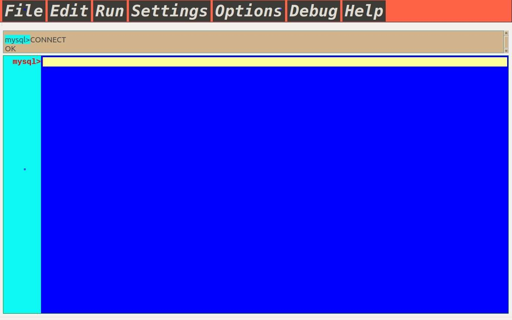</A>
<A href="shot2.jpg">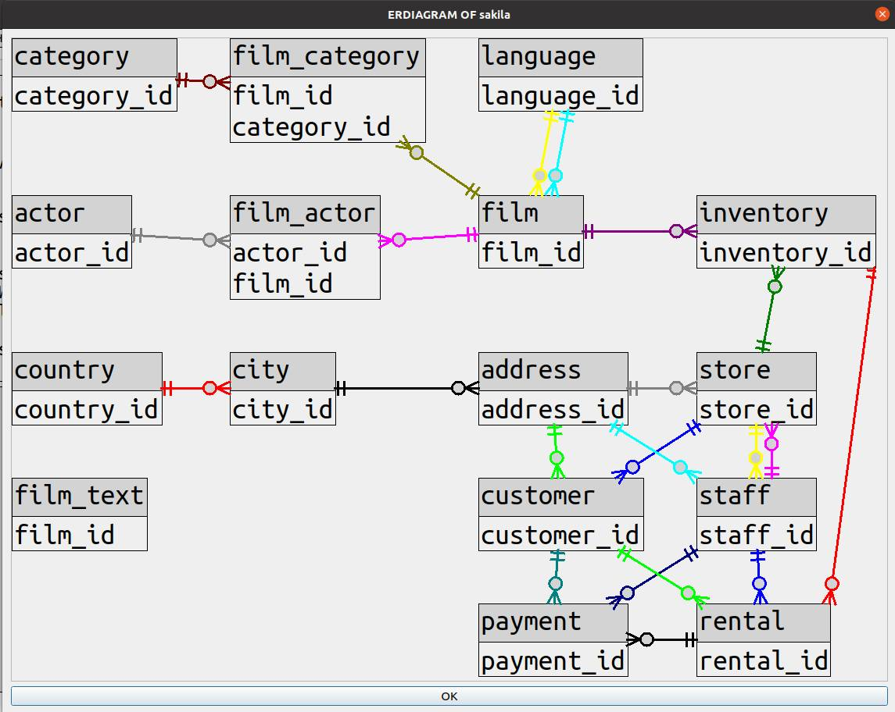</A>
<A href="shot3.png">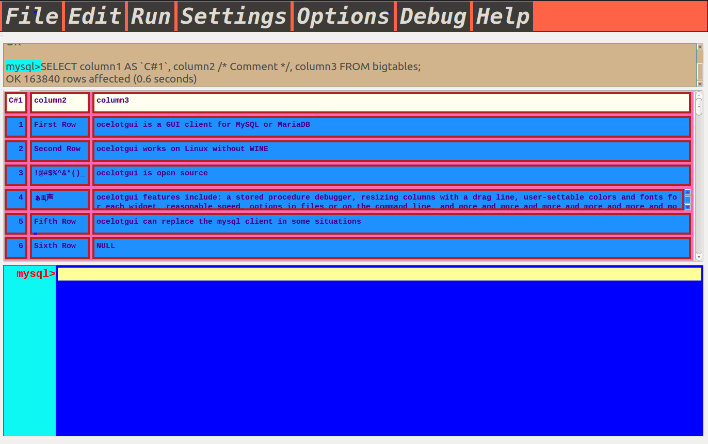</A>
<A href="shot4.jpg">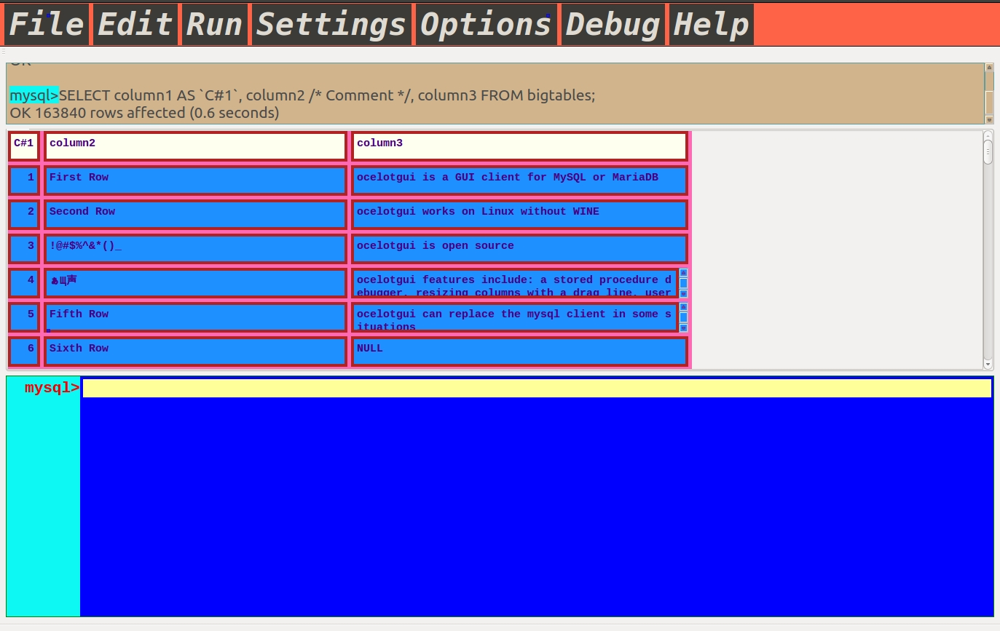</A>
<A href="shot5.jpg">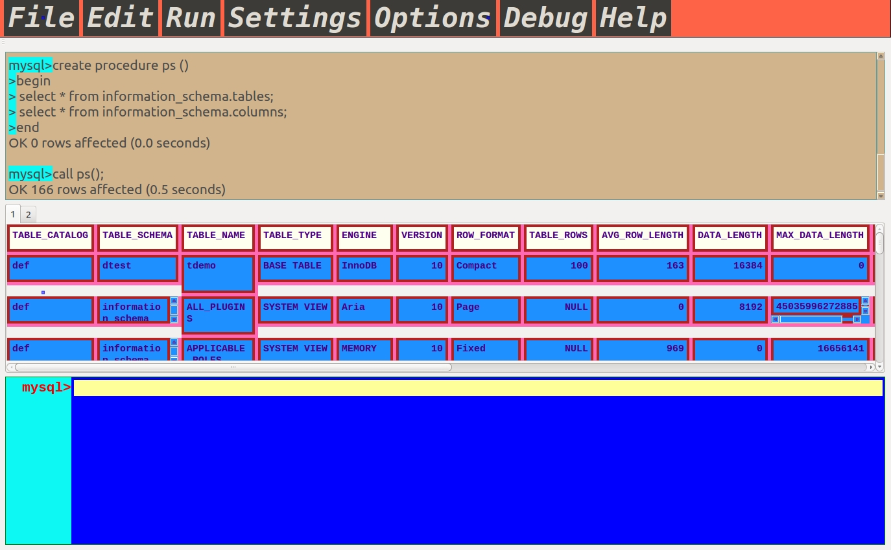</A>
<A href="shot6.jpg">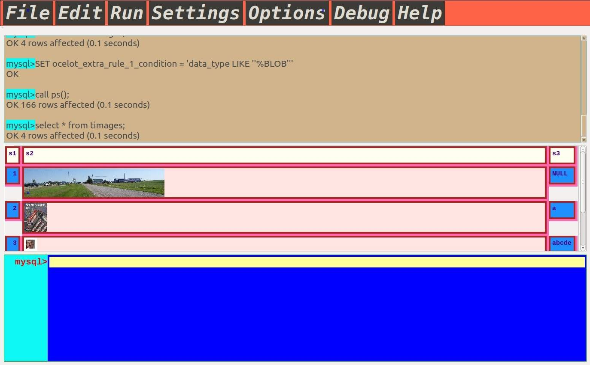</A>
<A href="shot7.jpg">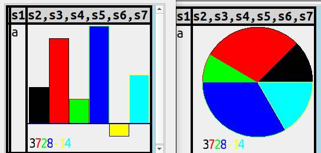</A>
<A href="shot8.jpg">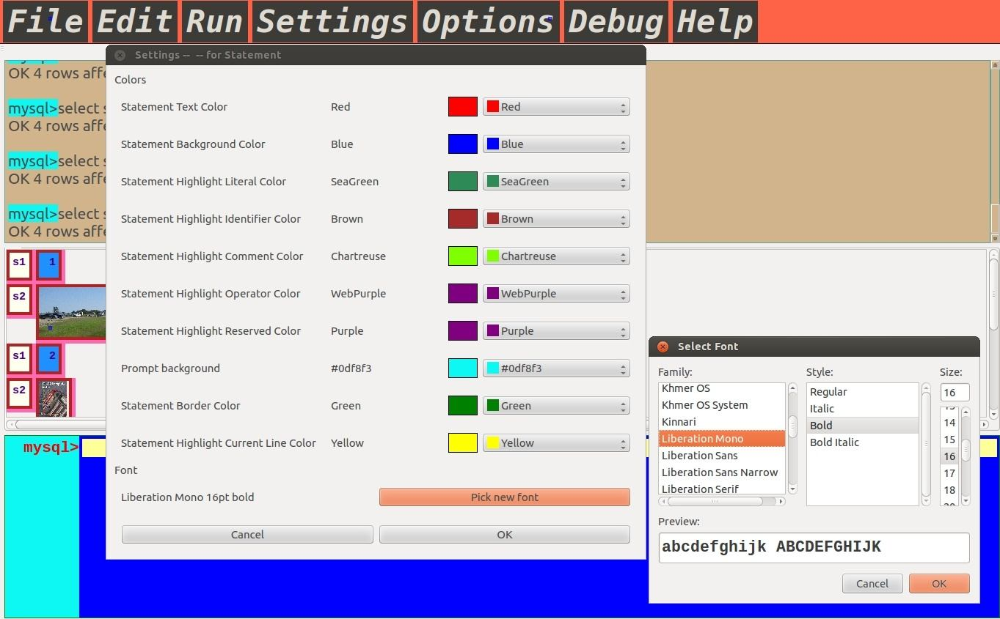</A>
<A href="shot9.jpg">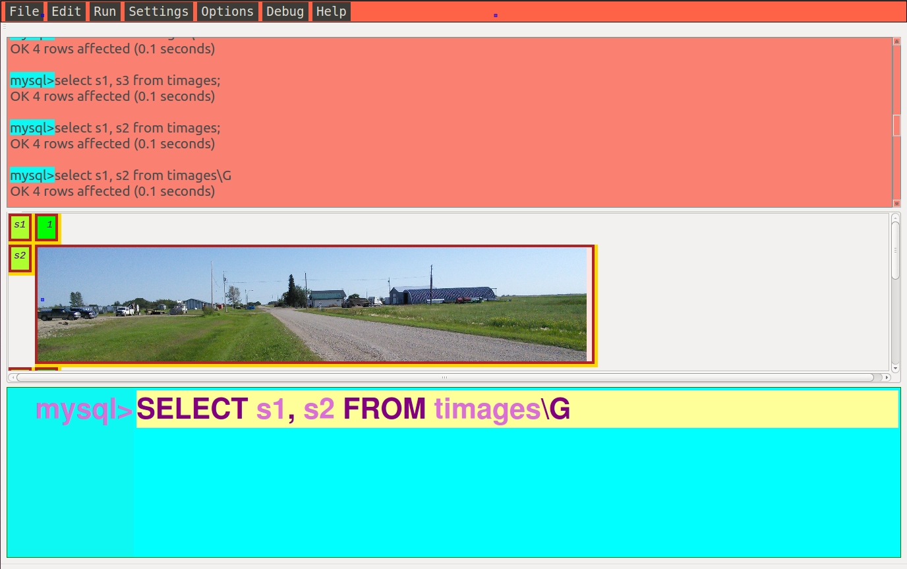</A>
<A href="shot10.jpg">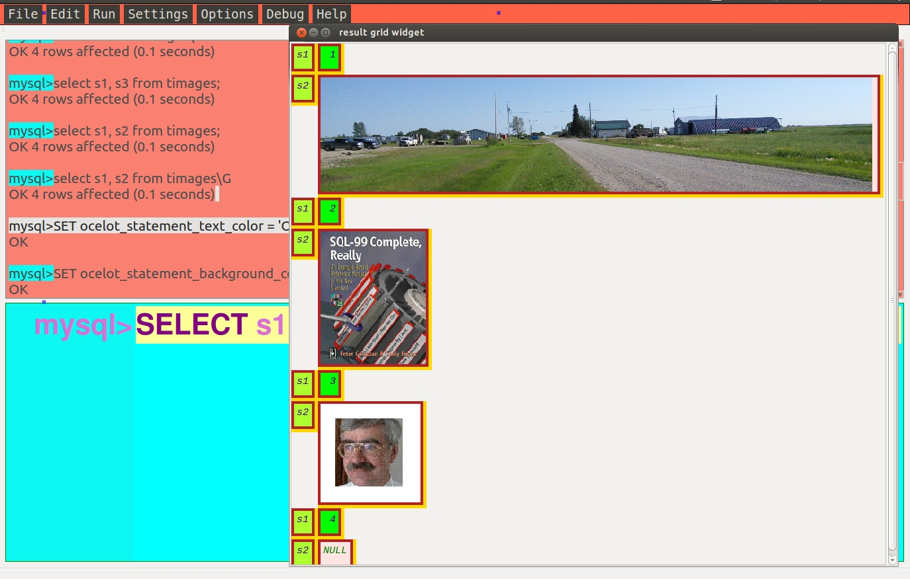</A>
<A href="shot11.png">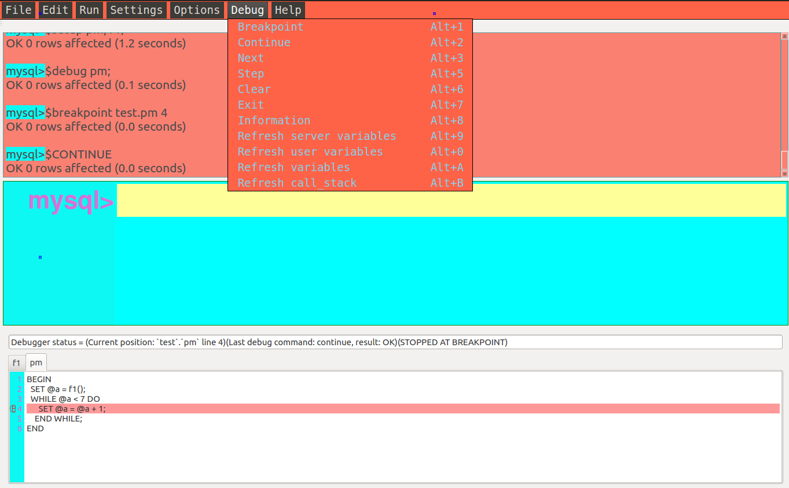</A>

<H2 ID="user-manual">User Manual</H2>

Version 1.6.0, January 9 2022

Copyright (c) 2022 by Peter Gulutzan. All rights reserved.

  

This program is free software; you can redistribute it and/or modify  
it under the terms of the GNU General Public License as published by  
the Free Software Foundation; version 2 of the License.

  

This program is distributed in the hope that it will be useful,  
but WITHOUT ANY WARRANTY; without even the implied warranty of  
MERCHANTABILITY or FITNESS FOR A PARTICULAR PURPOSE. See the  
GNU General Public License for more details.

  

You should have received a copy of the GNU General Public License  
along with this program; if not, write to the Free Software  
Foundation, Inc., 51 Franklin St, Fifth Floor, Boston, MA 02110-1301 USA

<H3 id="executive-summary">Executive Summary</H3>

The ocelotgui application, previously called
'The Ocelot Graphical User Interface', allows users to connect to
a MySQL or MariaDB DBMS server, enter SQL statements, and receive results.
Some of its features are: syntax highlighting, user-settable colors
and fonts for each part of the screen, and result-set displays
with multi-line rows and resizable columns, and a debugger.

<H3 id="the-developer-the-product-and-the-status">The developer, the product, and the status</H3>

Peter Gulutzan is a Canadian
who has specialized in database products for thirty years,
as an employee of Ocelot Computer Services Inc. and
MySQL AB and Sun Microsystems and Oracle and HP, or as a
contractor for a large company in eastern Europe.

  

The ocelotgui program is a front end which connects to MySQL (tm) or MariaDB (tm).
In some ways it is like the basic mysql client program,
with added GUI features: full-screen editing, syntax
highlighting, tabular display, customized fonts and colors.
It differs from some other front-end GUI products because
it is open source (GPL), it is written in C++, and it makes use
of the Qt multi-platform widget library.

  

The product status is: stable. It has been known to work as described in
this manual on several Linux distros. It is stable, in the sense that
there are no known severe errors and the features are frozen until the
next version.
Peter Gulutzan will address any bug reports and will answer any questions.

<H3 id="downloading-installing-and-building">Downloading, installing, and building</H3>

To download the product go to
<A HREF="https://github.com/ocelot-inc/ocelotgui">https://github.com/ocelot-inc/ocelotgui</A>.
Instructions for installation will be in the README.md file.
This location may change, or alternate locations may appear.
If so there will either be an announcement on github or on ocelot.ca.

The package contains source code and an executable file named ocelotgui-qt5.

<H3 id="starting">Starting</H3>

There must be an instance of MySQL or MariaDB running somewhere.  

If connection is possible with the mysql client and does not require
unusual options, then connection is possible with ocelotgui. If there is
a my.cnf file, ocelotgui will read it, just as the mysql client would.
If there are connection-related options on the command line, ocelotgui
will accept them just as the mysql client would. Therefore the typical
way to start the program is to say  
ocelotgui [--option [--option...]]  
 
For a description of options see  <A href="#Appendix-1">Appendix 1 Details about ocelotgui options</A>.

<A href="starting-dialog.png">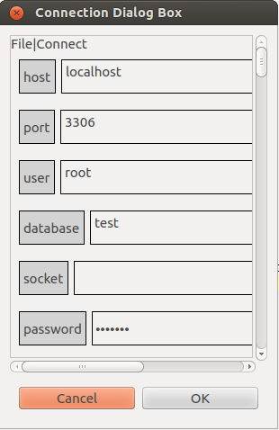</A>
If a password is required but not supplied, a dialog box will appear.
Or, if the initial attempt to connect fails, an error message will appear
saying it is necessary to choose File|Connect, which will cause the dialog
box to appear. The dialog box has many possible settings
(see the list in <A href="#Appendix-1">Appendix 1</A>;
however, for getting started, the ones that matter most are the ones
at the top: host, port, user, socket, password, protocol.  
If the connection still fails, then ocelotgui will still come up,
but only non-DBMS tasks such as screen customizing will be possible.
 

<A href="starting.png">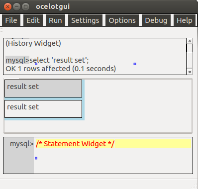</A>
In any case, an initial screen will appear. After some activity has
taken place, the screen will have four parts, from top to bottom: 
menu  
history widget, where retired statements and diagnostics end up  
results widget, where SELECT result sets appear  
statement widget, where users can type in instructions. 
Initially, though, only the menu and statement widget will appear.

Again, this should be reminiscent of the way the mysql client works:
statements are typed at the bottom of the screen, and appear to
scroll off the top after they are executed, with results in the middle.  

 
<H3 id="statement-widget">Statement widget</H3>

The statement widget is an editable multi-line text box.
The usual control keys that work on other text editors will work
here too; see the later description of Menu Item: Edit.

  

The program includes a syntax checker and can recognize the parts of
speech in MySQL grammar.
It will do syntax highlighting
by changing the color, for example comments will appear in light green,
identifiers in green, operators in dark gray, and so on.  
The colors can be
customized, see the later description of Menu Item: Settings.

The left side of the statement widget is reserved for the prompt,
and cannot be typed over. Initially the prompt will be 'mysql&gt;'
but this can be changed, see the later description of
Client Statements: Prompt.  

<A href="statement-widget-example.png">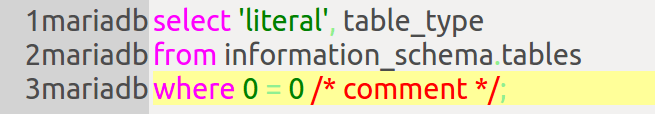</A>
For example, this screenshot shows the statement widget
after the user has changed the default prompt and
entered an SQL statement.
The statement has keywords in magenta, literals in dark green,
operators in light green, and comments in red.
The prompt on the left has a gray background.
  

Major Feature Alert: this is not merely a GUI that only will
highlight words that are in a list of keywords.
This GUI will parse the complete MySQL or MariaDB grammar,
without needing to ask the server. So the highlighting
will be correct, syntax errors will be underlined in red,
and -- since the parsing method is predictive -- there will be
continuous hints about what word is expected next, and
optionally an error message explaining suspected syntax problems
before they go to the server.

Once a statement has been entered and is ready to be executed,
the user can hit control-E, choose menu item Run|Execute, or
place the cursor at the end of the text (after the ';' or other
delimiter) and type Enter. It is legal to enter multiple
statements, separated by semicolons, and then execute them
in a single sequence.

<H3 id="client-statements">Client statements</H3>

A client statement is a statement which changes some behavior
of the client (that is, of the ocelotgui front end) but does not
necessarily go to the MySQL/MariaDB server. Of the statements
that the MySQL Reference manual describes in section
'mysql client commands' <A HREF="https://dev.mysql.com/doc/refman/8.0/en/mysql-commands.html">https://dev.mysql.com/doc/refman/8.0/en/mysql-commands.html</A>
the ocelotgui program has working equivalents for: clear, delimiter, exit,
prompt, source, tee, and warnings. For example, entering 'quit;'
followed by Enter will cause the program to stop. It is
sometimes not mandatory to end a client statement with ';',
but is strongly recommended.

There are some enhancements affecting the PROMPT statement.
The special sequence '&#92;2' means 'repeat the prompt on all lines',
and the special sequence '&#92;L' means 'show line numbers'. For example,
'PROMPT &#92;2&#92;Lmariadb;' will change the prompt so that each line begins
with '[line number] mariadb>'.

<H3 id="history-widget">History widget</H3>

Once a statement has been executed, a copy of the statement text
and the diagnostic result (for example: 0.04 seconds, OK) will
be placed in the history widget. Everything in the history widget
is editable including the prompt, and it simply fills up so that
after a while the older statements are scrolled off the screen.  
Thus its main function is to show what recent statements and
results were. Statements in the history can be retrieved while
the focus is on the statement widget, by selecting 'Previous statement'
or 'Next statement' menu items.

Initially the history widget will show some statements from past
sessions which are stored in a history file.

<H3 id="result-widget">Result widget</H3>

If a statement is SELECT or SHOW or some other statement that
returns a result set, it will appear in the result widget in
the middle area of the screen. The result widget is split up
into columns. Each column has a header and details taken from
what the DBMS returns.  

The width of the column depends on the result set's definition,
but extremely wide columns will be split onto multiple lines.
That is, one result-set row may take up to five lines.  
If the data still is too wide or too tall to fit in the cell,
then the row will get a vertical scroll bar. The user can
change the width of a column by dragging the column's right
border to the right to make the column wider, or to the left
to make it narrower.  

The result widget as a whole may have a horizontal and a vertical
scroll bar. The vertical scroll bar moves a row at a time rather
than a pixel at a time -- this makes large result sets more
manageable, but makes the vertical scroll bar unresponsive if
each row has multiple lines and the number of rows is small.  

For example, this screenshot shows the whole screen after the
user has typed the statement "select * from information_schema.tables;"
on the statement widget and then executed it. The statement text
has been copied to the history widget, the statement widget has
been cleared, the result widget has the rows. The user has
dragged the border of the fourth column to the left, causing
a scroll bar to appear.
 

<A href="result-widget-example.png">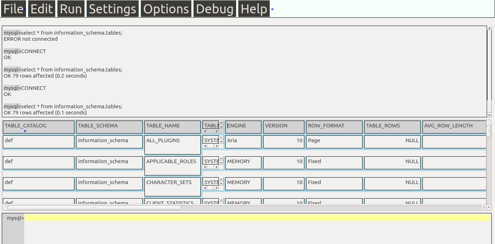</A>
 

  

<H3 id="menu">Menu</H3>

The menu at the top of the screen has File, Edit, Run, Settings,
Options, Debug and Help.

<A href="menu-file.png">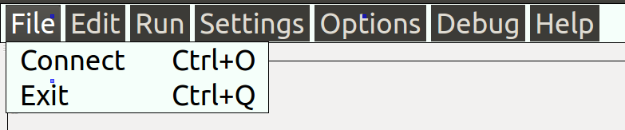</A>
File|Connect, or Ctrl+O, starts the Connect dialog box.  
File|Exit, or Ctrl+Q, stops the program.
File|Export brings up a dialog box for exporting selections.
 

<A href="menu-edit.png">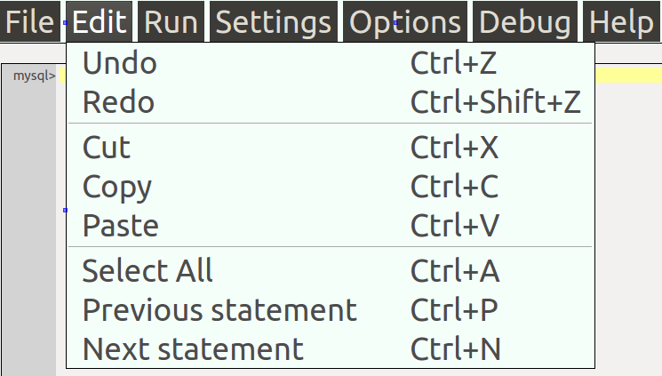</A>
Edit|Undo or Ctrl+Z, Edit|Redo or Ctrl+Shift+Z, Edit|Cut or Ctrl+X,
Edit|Cut or Ctrl+X, Edit|Copy or Ctrl+C, Edit|Paste or Ctrl+V,
and Edit|Select or Ctrl+A, all work in the conventional manner.
Edit|Redo can only redo the last change.  
Previous Statement or Ctrl+P and Next Statement or Ctrl+N will
copy earlier statements from the history widget into the statement
widget, so that they can be edited or re-executed with Run|Execute
or Ctrl+E.
Format or Alt+Shift+F changes what is in the statement
widget according to a simple style guide. Autocomplete or Tab will
be discussed later.
 

<A href="menu-run.png">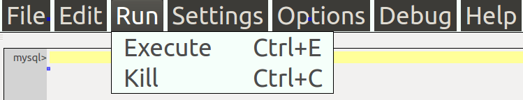</A>
Run|Execute or Ctrl+E or Ctrl+Enter causes execution of whatever is in the
statement widget.  
Run|Kill or Ctrl+C tries to stop execution -- this
menu item is enabled only when a long-running statement
needs to be aborted by user intervention.
 

<A href="menu-settings.png">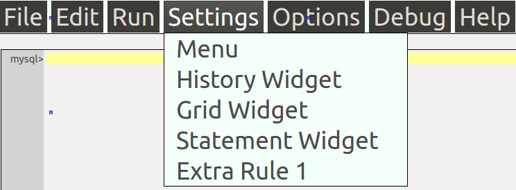</A>
Settings|Menu, Settings|History Widget, Settings|Grid Widget,
Settings|Statement, and Settings|Extra Rule 1 are
items which affect the behavior of each
individual widget. The color settings affect foregrounds,
backgrounds, borders, and (for the statement widget only)
the syntax highlights. The font settings affect font family,
boldness, italics, and size.
There may be additional choices affecting appearance,
for example the width of the border used to drag columns
in the result widget.
Settings|Extra Rule 1 is conditional -- for example, to specify
that BLOBs should be displayed as images on a pink background,
set Grid Background Color Pink, set Condition = data_type LIKE
'%BLOB', set Display As = image, then click OK.
 

<A href="menu-options.png">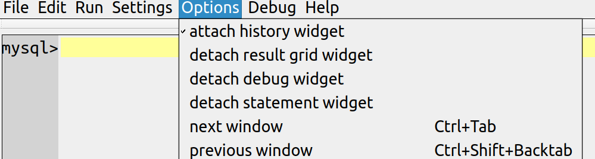</A>
Options|detach history widget,
Options|detach result grid widget,
Options|detach debug widget are
for turning the respective widgets into independent windows,
so that they can be moved away from the statement widget,
or resized. A detached widget is always kept on top of the
other widgets in the application screen. When a widget is
already detached, the menu item text will change to "attached"
and clicking it will put the widget back in its original position.
 

<A href="menu-debug.png">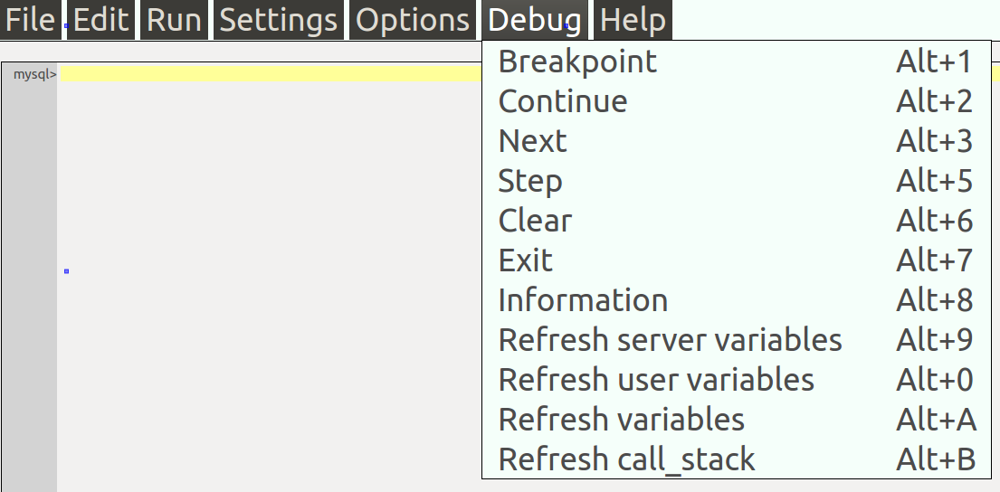</A>
The items on the Debug menu are enabled only when a debug session
is in progress. The way to debug SQL stored procedures or functions
will be explained in a later section.
 

  

<A href="menu-help.png">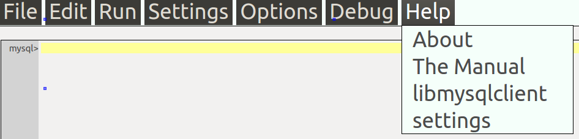</A>
Help|About will show the license and copyright and version.
Help|The Manual will show the contents of README.md (the manual that you are reading) if README.md is on the same path as
the ocelotgui program; otherwise it will show a copyright, a GPL license, and a pointer to README.md.
Help|libmysqlclient will advise about finding and loading the libmysqlclient.so library.
Help|settings will advise about how to use the Settings menu items.
 

<H3 id="debugger">Debugger</H3>

<A href="menu-options.png">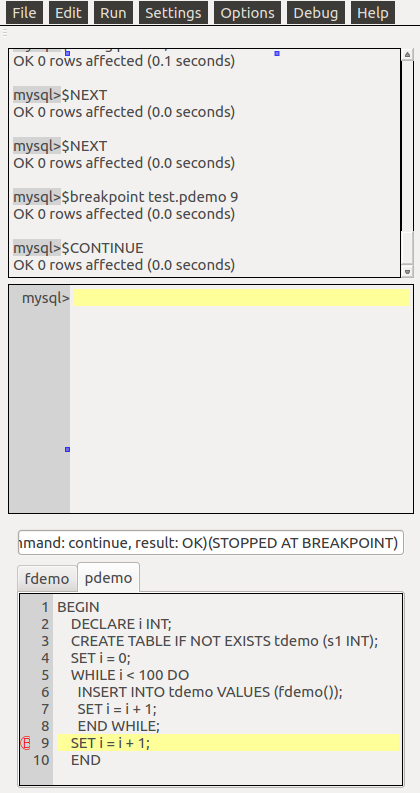</A>
It is possible to debug stored procedures and functions.  
This version of ocelotgui incorporates MDBug
(read about MDBug at <A HREF="http://bazaar.launchpad.net/~hp-mdbug-team/mdbug/trunk/view/head:/debugger.txt">http://bazaar.launchpad.net/~hp-mdbug-team/mdbug/trunk/view/head:/debugger.txt</A>).  
All debugger instructions can be entered on the ocelotgui command line;  
some operations can also be done via the Debug menu or by clicking on the stored-procedure display.  
Currently-supported instructions are:   
$install -- this is always the first thing to do.   
$setup routine_name [, routine_name ...] -- prepares so '$debug routine_name' is possible.   
$debug routine_name -- starts a debug session, shows routines in a tabbed widget.   
$breakpoint routine_name line_number or Debug|breakpoint -- sets a breakpoint.   
$clear routine_name line_number -- clears a breakpoint.   
$next or Debug|Next -- goes to next executable line, without dropping into subroutines.   
$step or Debug|Step -- goes to next executable line, will drop into subroutines.   
$continue or Debug|Continue -- executes until breakpoint or until end of procedure.   
$refresh breakpoints -- refreshes xxxmdbug.breakpoints table.   
$refresh server_variables -- refreshes xxxmdbug.server_variables table.   
$refresh variables -- refreshes xxxmdbug.variables table.   
$refresh user_variables -- refreshes xxxmdbug.user_variables table.   
$exit or Debug|Exit -- stops a debug session.   
 

For a walk through a debugger example, with screenshots, see
this blog post: <A HREF="http://ocelot.ca/blog/the-ocelotgui-debugger">http://ocelot.ca/blog/the-ocelotgui-debugger</A>.  
For reference, read: <A HREF="#Appendix-2">Appendix 2 Reference for the ocelotgui debugger (ocelotgui)"></A>.

<H3 id="special-effects">Special Effects</H3>

Vertical: If a user starts the program with ocelotgui --vertical=1
or ends a statement with backslash G, results come up with one column per row.  
  

<A href="special-images.png">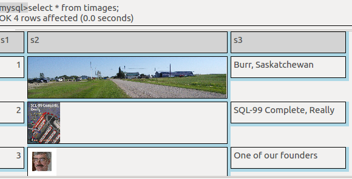</A>
Images: If a user chooses Settings | Extra Rule 1 from the menu,
and sets the Condition and Display As boxes as described earlier,
and selects rows which contain LONGBLOB columns, and the column values are
images (such as PNG or JPEG or BMP or GIF format data), ocelotgui will display
the result as images.  
 

Result-set editing: If a user clicks on a column in the result set
and makes a change, an update statement will appear in the statement widget.
For example, if a result set is the result from SELECT column1, column2 FROM t;,
and the column1 value is 5, and the column2 value is 'ABC', and the user changes
the column2 value to 'AB', then the
statement widget will show UPDATE t SET column2 = 'AB' WHERE column1 = 5 AND column2 = 'AB';.
The user then has the choice of ignoring the update statement or executing it.  

<A href="special-detach.png">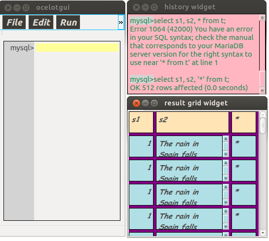</A>
Detaching: If a user chooses Options | detach history widget or
Options | detach result grid widget, then the widget will become a separate window
which can be moved or resized.  
 

<A href="special-settings.png">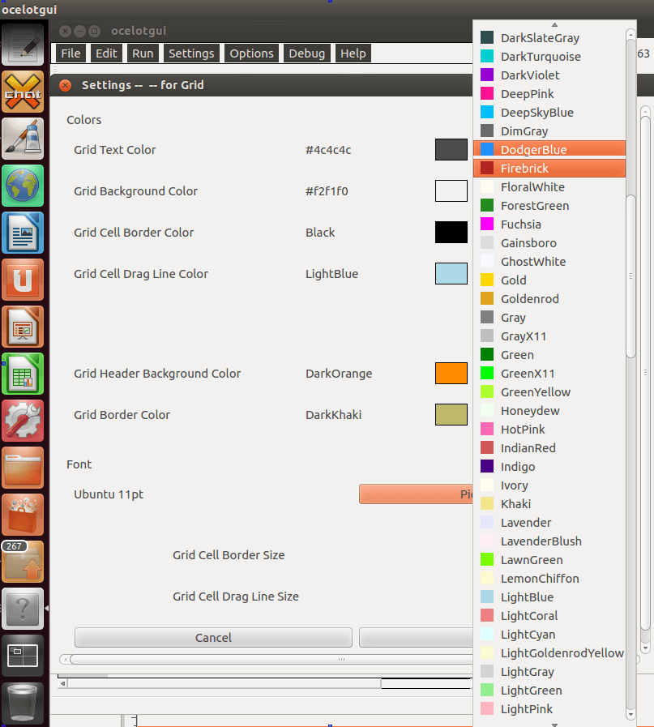</A>
Colors: The Colors and fonts dialog boxes have a simple way to choose
colors, by selecting from a choice of 148 color names / color icons. Users can also
change colors by saying SET object_name_color = color-name | hex-rgb-value.  
In fact ocelotgui mixes the modes: for example if a user chooses Settings | Grid Text Color,
then clicks on the 'Red' icon, then clicks OK, ocelotgui generates a
statement "SET ocelot_grid_text_color = 'Red';". This makes the instruction
easy to repeat or put in a script.
 

RE: SQL_MODE. To distinguish between literals and identifiers enclosed
in double quotes, ocelotgui needs to know the value of sql_mode (ansi_quotes).
It calculates this automatically; however, in rare circumstances it can
fail to detect changes on the server. If that appears to be the case, say
SET SESSION SQL_MODE = @@SESSION.SQL_MODE; to update it.

RE: AUTOCOMPLETION. While a user is entering an SQL statement,
ocelotgui will display a list of possible words that may follow.
Hitting the Tab key will cause the first word in the list to be
displayed and accepted.
Users can use arrow keys to select other words,
and can use "set ocelot_shortcut_autocomplete='...'; to choose a different key instead of the Tab key,
and can use "set ocelot_completer_timeout=...'; to choose how many seconds the list will be visible,
and can use "rehash;" to update the list. 
<A href="completer_1.png">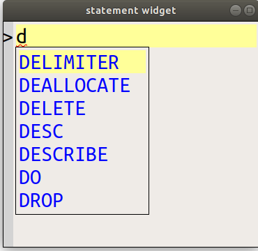</A> 
<A href="completer_2.png">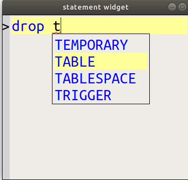</A> 
<A href="completer_3.png">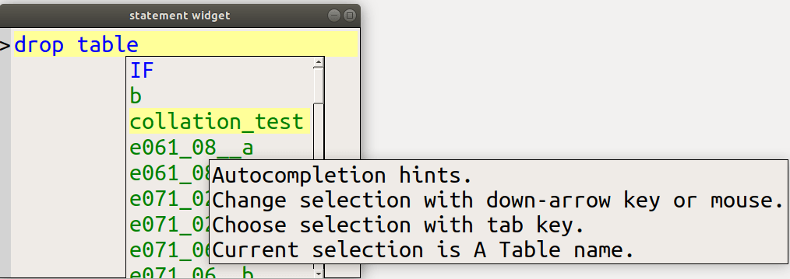</A>

RE: HINTING FOR COLUMN NAMES. Although hints for syntax appear by
default, hints for table / column identifiers might not. In order to
make identifiers appear on the hint list: (1) ensure the setting
for auto_rehash has not been turned off, and/or (2) enter the statement
"REHASH;" to make the client ask the server for a list of identifiers
in the current database; (3) when entering an SQL statement, type `
(backtick) at the point where an identifier is expected.

RE: FONT. By default, ocelotgui uses a fixed-pitch (mono) font that
has similar attributes to whatever font was in use
at the time it started. This may be a bad choice.
We recommend trying out other fonts with the Settings menu
for each widget.

RE: PERMANENT CUSTOMIZING. Changes to settings can be done
with the Settings menu items, but such changes are not permanent.
So note the commands that ocelotgui performs when settings are
changed, and paste them into a file. Later this file can be
executed (for example with SOURCE file-name), whenever ocelotgui
is started again. Alternatively, settings can be placed in
an options file such as my.cnf.

<A href="special-settings.png">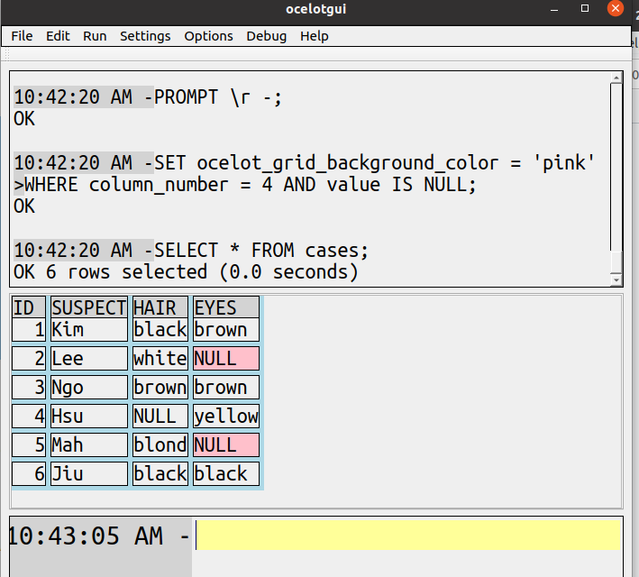</A>
RE: CONDITIONAL SETTINGS. To override the ordinary <A HREF="#special-settings">settings</A>
for result set displays there is a special SET statement with a WHERE clause: 
SET ocelot_grid_setting = string|integer [, ocelot_grid_value = string-or-integer...] 
WHERE condition [AND|OR condition ...]; 
where ocelot_grid_setting is OCELOT_GRID_BACKGROUND_COLOR | OCELOT_GRID_FONT_STYLE |  etc., 
and condition has the form item comparison-operator literal, where
item is COLUMN_NAME | COLUMN_NUMBER | COLUMN_TYPE | ROW_NUMBER | VALUE, 
and comparison-operator is = | > | >= | < | <= | <> | IS | REGEXP. 
For example to say "I want the background color to be pink if
it's in the fourth column of the result set and it's NULL", say 
SET ocelot_grid_background_color='pink' WHERE column_number = 4 AND value IS NULL;

RE: DEBUGGING WITH MYSQL 5.7. Oracle has made a significant
incompatible behavior change in version 5.7, which affects the
debugger. The originally recommended workaround was to say
"set global show_compatibility_56=on;". We believe we made a
more permanent fix for this problem in ocelotgui version 1.0.8.

RE: CONNECTION DIALOG. As stated earlier, if a password is necessary
to connect, it is sufficient to start ocelotgui with "--password=<i>password</i>"
or by choosing File|Connect and typing a password in the Password
field (the sixth field in the Connection Dialog Box). Also on the
Connection Dialog Box, if the server is running on the same computer
as the ocelotgui client, it is sometimes a good idea to enter
'127.0.0.1' in the host field, instead of 'localhost'.

RE: ROW NUMBERS. ocelotgui will replace the value 'row_number() over ()'
with the row number within the result set. For example, try 
SELECT 'row_number() over ()' as r, table_name.* FROM table_name; 
To disable this feature, start ocelotgui with --ocelot_client_side_functions=0.

RE: HOVERING. Use the mouse to hover over a word in the
statement widget, and ocelotgui will display what kind of word
it is, for example "table identifier".

RE: FORMAT. Click Edit|Format, and ocelotgui will change the contents of
the statement widget so that keywords are upper case and
sub-clauses or sub-statements are indented.

RE: HISTORY. By default the history does not contain any rows
from result sets of previous statements. To change this, click
Settings|History and enter a number for Max Row Count.
Also users can change the history file name with HISTFILE=name,
change what statements should not go to the ihstory file with HISTIGNORE=regexp,
change whether the history file will include system-generated comments with OCELOT_HISTFILEFLAGS='L'|'LP',
change how large the history file can become with OCELOT_HISTFILESIZE=number,
change how large the initial history can become with OCELOT_HISTSIZE=number.

RE: EXPORT. A result set can be dumped to a file as text, as table, or as html.

RE: TARANTOOL. By default ocelotgui is a client for MySQL or MariaDB.
To use it as a client for Tarantool, read
<A HREF="#Appendix-3">Appendix 3 Tarantool</A>.

<H3 id="contact">Contact</H3>

We need feedback!

Registered github users can simply go to
<A HREF="https://github.com/ocelot-inc/ocelotgui">https://github.com/ocelot-inc/ocelotgui</A>
and click the "Star" button.

Send bug reports and feature requests to
<A HREF="https://github.com/ocelot-inc/ocelotgui/issues">https://github.com/ocelot-inc/ocelotgui/issues</A>.
Or send a private note to pgulutzan at ocelot.ca.

There may be announcements from time to time on Ocelot's
web page (ocelot.ca) or on the employee blog (<A HREF="http://ocelot.ca/blog">http://ocelot.ca/blog</A>).

Any contributions will be appreciated.

<H3 id="Appendix-1">Appendix 1 Details about ocelotgui options</H3>

An option is a named value which affects connecting and behavior.
Most [ocelot] options are very similar to options of the mysql client.
  
The places that an option might be specified are:
within the program for example the default port value is 3306,
in an environment variable for example "export MYSQL_TCP_PORT=3306",
in a configuration file for example "port=3306" in $HOME/.my.cnf,
on the command line for example "./ocelotgui --port=3306",
or on the File|Connect dialog box.
  
Environment Variables. The ocelotgui program will look at these variables:
HOME, LD_RUN_PATH, MYSQL_GROUP_SUFFIX, MYSQL_HISTFILE,
MYSQL_HISTIGNORE, MYSQL_HOST, MYSQL_PS1, MYSQL_PWD.
MYSQL_TCP_PORT, MYSQL_UNIX_PORT, MYSQL_TEST_LOGIN_FILE.
  
Option Files: The ocelotgui program will look in these option files:
/etc/my.cnf, /etc/mysql/my.cnf, [SYSCONFDIR]/my.cnf,
[defaults-extra-file], $HOME/.my.cnf, $HOME/.mylogin.cnf.
Within option files, the ocelotgui program will look
in these groups: [client] [mysql] [ocelot], as well
as groups specified by MYSQL_GROUP_SUFFIX.
On Windows, the order is different: %system, %windir,
[application-directory], %MYSQL_HOME%, [defaults-extra-file].
  
Command Line: The ocelotgui program will look at command-line arguments
which are specified in short form such as "-P 3306", or
which are specified in long form such as "--port=3306".
  
Dialog Box: A dialog box will appear if the user enters a user statement
"CONNECT;" or if the user chooses menu item File|Connect.
The user will be advised to do this at startup time if an
initial attempt to connect fails.
  
Example
 
The default value for "port" is 3306, this is
hard coded in the ocelotgui source. 
The environment variable value for "port" is 3307, this is
set by "export MYSQL_TCP_PORT=3307" before starting ocelotgui. 
The option file value for "port" is 3308, this is
set by putting "PORT=3308" in the [mysql] group in
the $HOME/.mysql.cnf file. 
The command-line value for "port" is 3309, this is
set by putting "--port=3309" on the command line
when starting the ocelotgui program. 
The dialog-box value for "port" is 3310, this is
set by choosing File|Connect, entering "3310" in
the widget labelled "Port", and clicking "OK". 
The ocelotgui program reads the settings in the
above order, therefore the port number is 3310.
  
Options in the following table are in the same order that one sees
on the File|Connect dialog box: first come the 8 important connect
options (host, port, user, database, socket, password, protocol,
init_command), then all the other options in alphabetical order. 
Unless otherwise stated, options are specifiable by saying 
[option_name] = [value] in an option file or 
--[option_name] = [value] on the command line 
(sometimes --[option_name] alone is sufficient for true|false values),
or in the dialog box. 
If an option value is irrelevant or invalid, the ocelotgui program
ignores it without displaying an error message.

 <table border="1" style="width:100%;background-color: #f1f1c1">
 <tr>
 <th>Option</th>
 <th>Description</th>
 </tr>
 <tr>
 <td valign="top">host</td>
 <td valign="top">Server address. Specifiable with MYSQL_HOST
environment variable, with host= in an option file, with
-h or --host on the command line, or in dialog box.
Example values: localhost 192.15.8.44 w@ww.com.
Warning: if host=localhost, ocelotgui tries to use a socket,
if this is not desirable then say localhost=127.0.0.1 instead.</td>
 </tr>
 <tr>
 <td valign="top">port</td>
 <td valign="top">Port that the server listens on, if the protocol is
TCP. Specifiable with
MYSQL_TCP_PORT environment variable, with port= in an option
file, with -P or --port on the command line, or in dialog box.
Example values: 3306 3307.</td>
</tr>

<tr>
<td valign="top">user</td>
<td valign="top"> User name. Specifiable with user= in an option file,
with -u or --user on the command line, or in dialog box.
Example values: root guest jsmith.</td>
</tr>

<tr>
<td valign="top">database</td>
<td valign="top">Database name also known as schema name. Specifiable
with database= in an option file, with -D or --database on the
command line, or in dialog box. Example values: test account_data.
</td>
</tr>

<tr>
<td valign="top">socket</td>
<td valign="top">Socket name that the server receives on, if the
protocol is SOCKET. Specifiable with socket= in an option file,
with -S or --socket= on the command line, or in dialog box.
Examples: var/lib/special.sock /home/user/x.sock.
</td>
</tr>

<tr>
<td valign="top">password</td>
<td valign="top">Password associated with the user. Specifiable
with password= in an option file, with -p or --password= on
the command line, or in dialog box. If the password is
required but not specified, the dialog box will always appear.
Examples: sesame top_secret#1</td>
</tr>

<tr>
<td valign="top">protocol</td>
<td valign="top">How the connection to the server occurs. Possible
values are: blank or TCP or SOCKET. If host=localhost and
protocol is blank, then SOCKET is assumed. Specifiable with
protocol= in an option file, with --protocol= on the command
line, or in dialog box. Examples: tcp socket.</td>
</tr>

<tr>
<td valign="top">init_command</td>
<td valign="top">Initial statement that should be executed as
soon as connect is complete. Example: "select current_user()".</td>
</tr>

<tr>
<td valign="top">auto_rehash</td>
<td valign="top">If 1 (true), ocelotgui may try to
complete names.</td>
</tr>

<tr>
<td valign="top">auto_vertical_output</td>
<td valign="top">If 1 (true), ocelotgui will display
with one column per row.</td>
</tr>

<tr>
<td valign="top">batch</td>
<td valign="top">Mostly ignored, but if 1 (true), history is not written.</td>
</tr>

<tr>
<td valign="top">compress</td>
<td valign="top">If 1 (true), value is passed to the server.</td>
</tr>

<tr>
<td valign="top">connect_expired_password</td>
<td valign="top">If 1 (true), ocelotgui goes into
sandbox mode if a password has expired at connect time.</td>
</tr>

<tr>
<td valign="top">connect_timeout</td>
<td valign="top">Ignored.</td>
</tr>

<tr>
<td valign="top">debug</td>
<td valign="top">Ignored.</td>
</tr>

<tr>
<td valign="top">debug_check</td>
<td valign="top">Ignored.</td>
</tr>

<tr>
<td valign="top">debug_info</td>
<td valign="top">Ignored.</td>
</tr>

<tr>
<td valign="top">default_auth</td>
<td valign="top">Ignored.</td>
</tr>

<tr>
<td valign="top">default_character_set</td>
<td valign="top">Ignored, ocelotgui needs UTF-8.</td>
</tr>

<tr>
<td valign="top">defaults_extra_file</td>
<td valign="top">Name of an additional option file.</td>
</tr>

<tr>
<td valign="top">defaults_file</td>
<td valign="top">Ignored.</td>
</tr>

<tr>
<td valign="top">defaults_group_suffix</td>
<td valign="top">Suffix that is added to the regular group
names for option files. For example, if defaults_group_suffix=_X,
then ocelotgui will look at options in groups client_X and mysql_X and
ocelot_X in addition to options in groups client and mysql and ocelot.</td>
</tr>

<tr>
<td valign="top">delimiter</td>
<td valign="top">What ends a statement, usually semicolon ";".</td>
</tr>

<tr>
<td valign="top">enable_cleartext_plugin</td>
<td valign="top">Ignored.
</tr>

<tr>
<td valign="top">execute</td>
<td valign="top">String to execute followed by program exit.</td>
</tr>

<tr>
<td valign="top">force</td>
<td valign="top">Ignored, ocelotgui always ignores errors in options.</td>
</tr>

<tr>
<td valign="top">help</td>
<td valign="top">Display a help message followed by program exit.</td>
</tr>

<tr>
<td valign="top">histfile</td>
<td valign="top">Name of file where statements are logged to, usually
".mysql_history". Ignored if batch=1. Ignored if
histfile=/dev/null.</td>
</tr>

<tr>
<td valign="top">histignore</td>
<td valign="top">Pattern to ignore when writing to histfile.
For example, if histignore is "*select*", then statements
containing the string "select" will not be written.
</tr>

<tr>
<td valign="top">html</td>
<td valign="top">Internally formats are HTML anyway even if one says
html=0, unless one starts with one of the non-HTML options such as
batch or xml. If one starts ocelotgui with --html --raw,
the actual html markup code will appear.</td>
</tr>

<tr>
<td valign="top">ignore_spaces</td>
<td valign="top">Ignored.</td>
</tr>

<tr>
<td valign="top">ld_run_path</td>
<td valign="top">Where to look for libmysqlclient.so. Click help|libmysqlclient
for details.</td>
</tr>

<tr>
<td valign="top">line_numbers</td>
<td valign="top">Ignored.</td>
</tr>

<tr>
<td valign="top">local_infile</td>
<td valign="top">If 1 (true), passed to the server.</td>
</tr>

<tr>
<td valign="top">login_path</td>
<td valign="top">Where to find login file if it's not "~/.mylogin.cnf".</td>
</tr>

<tr>
<td valign="top">max_allowed_packet</td>
<td valign="top">Passed to the server. Default 16777216.</td>

<tr>
<td valign="top">max_join_size</td>
<td valign="top">Passed to the server. Default 1000000.</td>
</tr>

<tr>
<td valign="top">named_commands</td>
<td valign="top">Ignored.</td>
</tr>

<tr>
<td valign="top">net_buffer_length</td>
<td valign="top">Passed to the server. Default 16384.</td>
</tr>

<tr>
<td valign="top">no_beep</td>
<td valign="top">Ignored, ocelotgui does not usually beep when errors occur.</td>
</tr>

<tr>
<td valign="top">no_defaults</td>
<td valign="top">If 1 (true), options in environment variables and option
files are read but not used.</td>
</tr>

<tr>
<td valign="top">ocelot_*</td>
<td valign="top">... Options that begin with "ocelot_" are only recognized
by the ocelotgui client. Everything on the Settings menu has an
associated option name. The intuitively-named settings options are:
ocelot_extra_rule_1_text_color ocelot_extra_rule_1_background_color
ocelot_extra_rule_1_condition ocelot_extra_rule_1_display_as
ocelot_grid_text_color ocelot_grid_background_color
ocelot_grid_header_background_color
ocelot_grid_font_family ocelot_grid_font_size ocelot_grid_font_style
ocelot_grid_font_weight ocelot_grid_cell_border_color
ocelot_grid_cell_border_size ocelot_grid_detached
ocelot_grid_html_settings
ocelot_grid_left
ocelot_grid_top
ocelot_grid_width
ocelot_grid_height
ocelot_grid_focus_cell_background_color
ocelot_grid_outer_color
ocelot_grid_cell_height
ocelot_grid_cell_width
ocelot_grid_tabs
ocelot_grid_tooltip
ocelot_history_text_color ocelot_history_background_color
ocelot_history_border_color ocelot_history_font_family
ocelot_history_font_size ocelot_history_font_style
ocelot_history_font_weight ocelot_menu_text_color ocelot_history_detached
ocelot_menu_background_color ocelot_menu_border_color
ocelot_menu_font_family ocelot_menu_font_size
ocelot_menu_font_style ocelot_menu_font_weight
ocelot_statement_text_color ocelot_statement_background_color
ocelot_statement_border_color ocelot_statement_font_family
ocelot_statement_font_size ocelot_statement_font_style
ocelot_statement_font_weight ocelot_statement_highlight_literal_color
ocelot_statement_highlight_identifier_color ocelot_statement_highlight_comment_color
ocelot_statement_highlight_operator_color ocelot_statement_highlight_keyword_color
ocelot_statement_prompt_background_color ocelot_statement_highlight_function_color
ocelot_statement_highlight_current_line_color ocelot_statement_detached.
See also: the ocelot_ options which aren't related to Settings, below.</td>
See also: the example.cnf file.
</tr>

<tr>
<td valign="top">ocelot_client_side_functions</td>
<td valign="top"> ocelot_client_side_functions=0 turns off
the client-side functions, such as "select row_number() over ...".
This may be unnecessary with newer versions of MariaDB.
The default is 1.</td>
</tr>

<tr>
<td valign="top">ocelot_dbms</td>
<td valign="top">--ocelot_dbms=x means assume the server DBMS is x
until connection is made. The possible values are 'mysql',
'mariadb', and 'tarantool'. The default is 'mysql'.</td>
</tr>

<tr>
<td valign="top">ocelot_grid_tabs</td>
<td valign="top">ocelot_grid_tabs=5
means assume that a stored procedure can return up to 5 result sets.
The default is 16.</td>
</tr>

<tr>
<td valign="top">ocelot_language</td>
<td valign="top">--ocelot_language='english' means the menu and the
client error messages should be in English, --ocelot_language='french'
means the menu and the client error messages should be in French.
The default is 'english'.</td>
</tr>

<tr>
<td valign="top">ocelot_statement_syntax_checker</td>
<td valign="top">setting
ocelot_statement_syntax_checker=1 turns on the
syntax checker; setting ocelot_statement_syntax_checker=2
turns on the syntax checker and is insistent -- if ocelotgui
doesn't like the syntax checker, a confirmation dialog box
will appear. The default is 1.</td>
</tr>

<tr>
<td valign="top">ocelot_shortcut_*</td>
<td valign="top">ocelot_shortcut_connect, ocelot_shortcut_exit, etc. ...
You can change what the shortcut is, for any menu
item, by specifying its name and a new keysequence.
For example: SET ocelot_shortcut_paste = 'Ctrl+Shift+K';</td>
</tr>

<tr>
<td valign="top">one_database</td>
<td valign="top">Ignored.</td>
</tr>

<tr>
<td valign="top">pager</td>
<td valign="top">Ignored.</td>
</tr>

<tr>
<td valign="top">pipe</td>
<td valign="top">Ignored.</td>
</tr>

<tr>
<td valign="top">plugin_dir</td>
<td valign="top">Ignored.</td>
</tr>

<tr>
<td valign="top">print_defaults</td>
<td valign="top">If 1 (true), ocelotgui displays defaults and exits.</td>
</tr>

<tr>
<td valign="top">prompt</td>
<td valign="top">What to display on left of statement lines.
Default is "mysql>".
The prompt can include special character sequences
for date, time, and line number.</td>
</tr>

<tr>
<td valign="top">quick</td>
<td valign="top">Ignored.</td>
</tr>

<tr>
<td valign="top">raw</td>
<td valign="top">Ignored.</td>
</tr>

<tr>
<td valign="top">reconnect</td>
<td valign="top">Ignored.</td>
</tr>

<tr>
<td valign="top">safe_updates</td>
<td valign="top">If 1 (true), ocelotgui passes 1 to the server.</td>
</tr>

<tr>
<td valign="top">secure_auth</td>
<td valign="top">If 1 (true), ocelotgui passes 1 to the server.</td>
</tr>

<tr>
<td valign="top">select_limit</td>
<td valign="top">The maximum number of rows to select; default is 0
which means infinity; ocelotgui passes this to the server.</td>
</tr>

<tr>
<td valign="top">server_public_key</td>
<td valign="top">Ignored.</td>
</tr>

<tr>
<td valign="top">shared_memory_base_name</td>
<td valign="top">Ignored.</td>
</tr>

<tr>
<td valign="top">show_warnings</td>
<td valign="top">If 1 (true), ocelotgui displays warnings which
result from problems that the server detects.</td>
</tr>

<tr>
<td valign="top">sigint_ignore</td>
<td valign="top">If 1 (true), ocelotgui will not stop statements
when user types control-C or chooses the menu item Run|Kill.</td>
</tr>

<tr>
<td valign="top">silent</td>
<td valign="top">Ignored.</td>
</tr>

<tr>
<td valign="top">ssl_*</td>
<td valign="top">ssl, ssl_ca, ssl_capath, ssl_cert, ssl_cipher, ssl_crl,
ssl_crlpath, ssl_key, ssl_verify_server_cert. SSL options
are accepted and passed to the server.</td>
</tr>

<tr>
<td valign="top">syslog</td>
<td valign="top">Ignored.</td>
</tr>

<tr>
<td valign="top">table</td>
<td valign="top">Ignored.</td>
</tr>

<tr>
<td valign="top">tee</td>
<td valign="top">Name of a file to dump statements and results to.</td>
</tr>

<tr>
<td valign="top">unbuffered</td>
<td valign="top">Ignored.</td>
</tr>

<tr>
<td valign="top">verbose</td>
<td valign="top">Ignored.</td>
</tr>

<tr>
<td valign="top">version</td>
<td valign="top">If 1 (true), ocelotgui displays a version number and exits.</td>
</tr>

<tr>
<td valign="top">vertical</td>
<td valign="top">If 1 (true), results are displayed with one column
per line.</td>
</tr>

<tr>
<td valign="top">wait</td>
<td valign="top">Ignored.</td>
</tr>
<tr>
<td valign="top">xml</td>
<td valign="top">If one starts with ocelotgui --xml, the grid display will
show raw xml. See also --html.</td>
</tr>
</table>

<H3 id="Appendix-2">Appendix 2 Reference for the ocelotgui debugger (ocelotgui)</H3>

Before trying to read this reference, it is a good idea to
become familiar with the ocelotgui client and try out the
simple <A HREF="http://ocelot.ca/blog/blog/2015/03/02/the-ocelotgui-debugger">demonstration on the ocelot.ca blog</A>.

Temporary warning: for debugging MySQL version 8.0 routines,
you need a recent ocelotgui version as pushed to source on
or after June 2018. Use ocelotgui version 1.0.7 or later.

All debug statements can be entered on the Statement widget,
optionally ending with ";". 
Some debug statements can be invoked via the menu or with shortcut keys. 
Like other statements, debug statements are editable, are logged,
and can cause error or warning messages to appear in the history. 
Most statements can be entered even while the routine is running. 
Warning: the focus can change, be sure that the cursor is blinking
on the Statement Widget and not on the Debug Widget before entering
a statement. 
The following table shows statements in alphabetical order.

 <table border="1" style="width:100%;background-color: #f1f1c1">
<tr>
<th valign="top">Statement</td>
<th valign="top">What it's for</td>
<th valign="top">Syntax</td>
<th valign="top">Example</td>
<th valign="top">Remarks</td>
</tr>

<tr>
<td valign="top">$breakpoint</td>
<td valign="top">specifying a line where execution must stop.</td>
<td valign="top">$b[reakpoint [schema_identifier.] routine_identifier line_number [condition]
                  <B>Shortcut:</B>
                 Alt+1, or via menu: Debug|Breakpoint, or click on line
                 (If a shortcut is used, the breakpoint is set for
                 the routine that is currently being
                 displayed, for the line the cursor is on.)</td>
<td valign="top">$breakpoint test.p 5; 
                 (The debugger must be running -- see $debug.)</td>
<td valign="top">If $breakpoint succeeds, a red marker will appear on
                 the left of the line. The breakpoint identifier will
                 be displayed on the Debug Widget.
                 Users can set breakpoints on any line.
                 Users should not set breakpoints twice on the same line.
                 Later, if the user enters $continue or $next,
                 execution may stop when a line with a breakpoint is seen.
                 To turn off a breakpoint, a user may click on the line
                 (it is a "toggle" switch), or see $clear and $delete.
                 Re condition:
                 A condition is an expression which must be true, otherwise
                 the breakpoint is ignored during execution. For example,
                 $breakpoint p20 5 x = 7;
                 sets a breakpoint which will only cause execution to halt
                 if x = 7. The expression must have the form
                 variable_name = literal, variable_name should be a
                 declared variable, and the literal should be numeric.
                 At time of writing, conditions are not well tested.</td>
</tr>

<tr>
<td valign="top">$clear</td>
<td valign="top">removing a breakpoint</td>
<td valign="top">$cl[ear] [schema_identifier.] routine_identifier line_number
                  <B>Shortcut:</B>
                 Alt+6, or via menu: Debug|Clear
                 (If a shortcut is used, the breakpoint is removed
                 for the routine that is currently being displayed,
                 for the line that the cursor is on.)</td>
<td valign="top">$clear p 5; 
                 (The debugger must be running -- see $debug.) 
                 (The breakpoint must exist (see $breakpoint.)</td>
<td valign="top">The breakpoint's red marker should disappear.
                 If it does not disappear, and a shortcut was used:
                 make sure the cursor is actually on the line, not
                 just on the line number, which is considered separate.</td>
</tr>

<tr>
<td valign="top">$continue</td>
<td valign="top">running the routine till it ends or till a breakpoint.</td>
<td valign="top">$co[ntinue]
                  <B>Shortcut:</B>
                 Alt+6, or via menu: Debug|Continue</td>
<td valign="top">$continue; 
                 (The debugger must be running -- see $debug.)</td>
<td valign="top">$continue differs from $next and $step because it
                 does not halt on a following statement, it goes on
                 until it reaches a line with a breakpoint or until
                 the main routine ends.</td>
</tr>

<tr>
<td valign="top">$debug</td>
<td valign="top">beginning a debug session.</td>
<td valign="top">$deb[ug] [schema_identifier.] routine_identifier
                 [(parameter list)];
                  <B>Shortcut:</B>
                 None, $debug is not on the Debug menu.</td>
<td valign="top">$debug procedure21; 
    $debug function_x(7);
    (The debugger must not be already running.
    The routine must be set up -- $setup.)
    The user must have appropriate privileges.)</td>
<td valign="top">If $debug is successful, then a Debug Widget
                 will appear (see section Debug Widget).</td>
</tr>

<tr>
<td valign="top">$exit</td>
<td valign="top">ending a debug session</td>
<td valign="top">$exi[t]
                  <B>Shortcut:</B>
                 Alt+7, or via menu: Debug|Exit</td>
<td valign="top">$exit; 
                 (The debugger must be running -- see $debug.)</td>
<td valign="top"></td>
</tr>

<tr>
<td valign="top">$information status</td>
<td valign="top">showing information about debugger status</td>
<td valign="top">$inf[ormation status]
                  <B>Shortcut:</B>
                 Alt+8, or via menu: Debug|Information
                 (Choosing from the menu may not work on some platforms.)</td>
<td valign="top">$information status; 
                 select * from xxxmdbug. information_status;</td>
<td valign="top">The $information status statement will populate a table
                 named xxxmdbug. information_status, which contains
                 debugger_name, debugger_version,
                 timestamp_of_status_message, number_of_status_message,
                 icc_count, schema_identifier, routine_identifier,
                 line_number, is_at_breakpoint, is_at_tbreakpoint,
                 is_at_routine_exit, stack_depth, last_command,
                 last_command_result, commands_count.
                 The most important items of information status are
                 displayed automatically along with the Debug Widget,
                 so $information status is only for advanced users.</td>
</tr>

<tr>
<td valign="top">$install</td>
<td valign="top">install the debugger</td>
<td valign="top">$ins[tall]
                  <B>Shortcut:</B>
                 $install is not on the Debug menu.</td>
<td valign="top">$install; 
                 (The user must have appropriate privileges.)</td>
<td valign="top">A large group of procedures and tables are
                 placed in a database named xxxmdbug.
                 Installation may take up to 20 seconds.
                 It is only necessary to run $install once,
                 but it may be redone, for example if a new
                 version of ocelotgui is used.
                 If $install is not done, none of the other
                 debug statements are possible.</td>
</tr>

<tr>
<td valign="top">$leave</td>
<td valign="top">exit from a loop without executing</td>
<td valign="top">$l[eave]
                  <B>Shortcut:</B>
                 None, $leave is not on the Debug menu.</td>
<td valign="top">Suppose this routine is being debugged: 
                 begin 
                   declare x int; 
                   set x = 0; 
                   while x < 5 do 
                     set x = x + 0; 
                     end while; 
                   end 
                 The user types $continue, which gets the
                 program running -- in an infinite loop.
                 One way to break out of the loop is with
                 "$set x = 6;", another way is with $leave.
                 ($leave will also continue, so if you want
                 to stop after leaving you must set a brekapoint.) 
                 (The debugger must be running --see $debug.) 
                 (The procedure must be executing within a
                 loop.)</td>
<td valign="top">If the $leave statement is used when the
                 routine is not in a loop, consequences are
                 undefined -- this is not recommended.</td>
</tr>

<tr>
<td valign="top">$next</td>
<td valign="top">Making the program go to the next statement
                 in the current routine.</td>
<td valign="top">$n[ext];
                  <B>Shortcut:</B>
                 Alt+3, or via menu: Debug|Next</td>
<td valign="top">Suppose that the current line in procedure p is 
                 select f() from t; 
                 After $next, the current line changes to
                 the line following the select statement,
                 or (if this was the last line) routine exit. 
                 (The debugger must be running --see $debug.)</td>
<td valign="top">$next is different from $step because $step
                 can drop into a subroutine, $next does not.</td>
</tr>

<tr>
<td valign="top">$refresh breakpoints</td>
<td valign="top">showing what breakpoints exist.</td>
<td valign="top">$refresh breakpoints;
                  <B>Shortcut:</B>
                 None. $refresh breakpoints is not on the Debug menu.</td>
<td valign="top">$refresh breakpoints; 
    select * from xxxmdbug. breakpoints;</td>
<td valign="top">The $refresh breakpoints statement will populate a table
                 named xxxmdbug. breakpoints, which contains
                 breakpoint_identifier, schema_identifier,
                 routine_identifier, routine_type, line_number_minimum,
                 line_number_maximum, condition_identifier,
                 condition_operator, condition_value, hit_count,
                 is_temporary, is_temporary_and_to_be_cleared,
                 is_matching_location, call_stack_depth_when_set,
                 command. For simple breakpoints which were set up with
                 $breakpoint schema.routine line_number,
                 $refresh breakpoints is unnecessary because
                 breakpointed lines are marked in the Debug Widget.</td>
</tr>

<tr>
<td valign="top">$refresh call_stack</td>
<td valign="top">showing what the routines are that got us here.</td>
<td valign="top">$refresh call_stack
                  <B>Shortcut:</B>
                 Alt+B, or via menu: Debug|Refresh call_stack</td>
                 (Choosing from the menu may not work on some platforms.)</td>
<td valign="top">$refresh call_stack; 
    select * from xxxmdbug. call_stack;</td>
<td valign="top">Using menu Debug | Refresh call_stack will
                 cause two statements: $refresh and select.
                 The $refresh statement will populate a table
                 named xxxmdbug. call_stack, which contains
                 schema_identifier and routine_identifier and
                 routine_type and line_number, with one row
                 for each level. Thus, if routine p1 calls
                 p2 and routine p2 calls p3, there are three rows.
                 All $refresh statements may be blocked.</td>
</tr>

<tr>
<td valign="top">$refresh server variables</td>
<td valign="top">showing the contents of server variables.</td>
<td valign="top">$refresh server_variables
                  <B>Shortcut:</B>
                 Alt+9, or via menu: Debug|Refresh server_variables
                 (Choosing from the menu may not work on some platforms.)</td>
<td valign="top">$refresh server_variables; 
    select * from xxxmdbug. server_variables;</td>
<td valign="top">Using menu Debug | Refresh server_variables will
                 cause two statements: $refresh and select.
                 The $refresh statement will populate a table
                 named xxxmdbug. server_variables, which contains
                 variable_identifier and value and old_value.
                 For example, regardless what the routine is,
                 the available information will include that
                 there is a server variable named @@innodb_compression_level
                 which originally was null but now contains 6.
                 All $refresh statements may be blocked.
                 This statement is slow.</td>
</tr>

<tr>
<td valign="top">$refresh user variables</td>
<td valign="top">showing the contents of user variables.</td>
<td valign="top">$refresh user_variables
                  <B>Shortcut:</B>
                 Alt+A, or via menu: Debug|Refresh user_variables. 
        (Choosing from the menu may not work on some platforms.)</td>
<td valign="top">$refresh user_variables; 
    select * from xxxmdbug. user_variables;</td>
<td valign="top">Using menu Debug | Refresh user_variables will
                 cause two statements: $refresh and select.
                 The $refresh statement will populate a table
                 named xxxmdbug. user_variables, which contains
                 variable_identifier and value and old_value.
                 Thus, if routine p has: 
                 1 BEGIN 
                 2  SET @x = 1; 
                 3  SET @x = 2; 
                 4  END; 
                 and execution has stopped on line 3, the
                 available information is that x is a bigint,
                 which formerly
                 contained 1, and now contains 2.
                 All $refresh statements may be blocked.</td>
</tr>

<tr>
<td valign="top">$refresh variables</td>
<td valign="top">showing the contents of declared variables.</td>
<td valign="top">$refresh variables
                  <B>Shortcut:</B>
                Alt+B, or via menu: Debug|Refresh variables</td>
<td valign="top">$refresh variables; 
                 select * from xxxmdbug. variables;</td>
<td valign="top">Using menu Debug | Refresh variables will
                 cause two statements: $refresh and select.
                 The $refresh statement will populate a table
                 named xxxmdbug. variables, which contains
                 schema_identifier and routine_identifier and
                 routine_type and token_number_of_declare and
                 variable_identifier and data_type and value
                 and old_value and is_in_scope and is_settable
                 and is_updated_by_set. Thus, if routine p has: 
                 1 BEGIN 
                 2  DECLARE x int; 
                 3  SET x = 1; 
                 4  SET x = 2; 
                 5  END; 
                 and execution has stopped on line 4, the
                 available information is that x is an integer
                 which was declared on line 2, which formerly
                 contained 1, and now contains 2, and is in scope.
                 All $refresh statements may be blocked.</td>
</tr>

<tr>
<td valign="top">$set</td>
<td valign="top">changing the value of a declared variable.</td>
<td valign="top">$set variable_name = value;
                  <B>Shortcut:</B>
                 None, $set is not on the Debug menu.</td>
<td valign="top">$set x = 55; 
    $set y = ''k''; 
    (The debugger must be running -- see $debug.) 
    (The variable must be in scope.) 
    (The value must be a literal.
    If it is a string literal, it must be
    enclosed within two quote marks --
    this is due to a temporary limitation.)</td>
</td>
<td valign="top">Only declared variables (variables that
                 are specified with "DECLARE variable_name ...")
                 can be changed with $set. There is no
                 statement for changing user variables or
                 system variables.
                 $set should only be done while at a breakpoint.</td>
</tr>

<tr>
<td valign="top">$setup</td>
<td valign="top"></td>
<td valign="top">$setu[p] [schema_identifier.] routine_identifier
                 [, [schema_identifier.] routine_identifier ...]
                  <B>Shortcut:</B>
                 None, $setup is not on the Debug menu.
<td valign="top">$setup p; 
    $setup test.procedure1, test.function2; 
    (The debugger must be installed -- (see $install.) 
    (Only procedures and functions may be listed,
    not triggers. For "$setup X.Y", the user must
    have CREATE privilege in schema X and EXECUTE
    privilege on routine Y.)</td>
<td valign="top">Unless a routine has been the object of $setup,
                 it cannot be debugged.
                 The $setup statement is slow, and if routines
                 are large it is very slow. However, the effect
                 is persistent so there is no need to run $setup
                 for every debug session -- it only needs to be
                 re-run if a routine is modified.
                 The maximum number of routines per setup is 10.
                 The $setup statement makes copies of routines,
                 but never never changes the original routines.
                 The default schema is what "select database();" returns.</td>
</tr>

<tr>
<td valign="top">$step</td>
<td valign="top">Making the program go to the next statement
                 in the current routine or a subroutine.</td>
<td valign="top">$st[ep]
                  <B>Shortcut:</B>
                 Alt+5, or via menu: Debug|Step</td>
<td valign="top">Suppose that the current line in procedure p is 
                 select f() from t; 
                 After $step, the current line changes to
                 the first line in function f. 
                 (The debugger must be running -- see $debug.)</td>
<td valign="top">$step is different from $next because $step
                 can drop into a subroutine, $next does not.</td>
</tr>

<tr>
<td valign="top">$tbreakpoint</td>
<td valign="top">specifying a line where execution must stop, once.</td>
<td valign="top">$t[breakpoint [schema_identifier.] routine_identifier line_number
                  <B>Shortcut:</B>
                 None, $tbreakpoint is not on the Debug menu.</td>
<td valign="top">$tbreakpoint test.p 5; 
                 (The debugger must be running -- see $debug.).</td>
<td valign="top">The effect is the same as for ordinary breakpoints,
                 see $breakpoint. However, a tbreakpoint (temporary
                 breakpoint) becomes disabled after being hit once.
                 Generally it is better to use $breakpoint and
                 $clear; $tbreakpoint is not recommended.</td>
</tr>
</table>

<h4>Debug Widget</h4>

The Debug Widget appears at the bottom of the window after
execution of $debug, and disappears after execution of $exit.
It is a tabbed widget, that is, if $setup was done for multiple
routines, then the debug widget has multiple tabs and the user
can look at a particular routine by clicking its tab.

Above the widget is a line with information about current state.
The state information includes the current position (what routine
and line number is currently being executed), the result of the
last debug statement, and whether the execution is currently halted
(it will show "stopped at breakpoint" initially because there is
automatically a temporary breakpoint at the start) (it will show
"executing" if it is running) (it will show "routine end" at end).
For example the line may contain 
"Debugger status = (Current position: `test`.`p24` line 3)
 (Last debug command: tbreakpoint test.p24 3, result: OK, breakpoint_identifier=3)
 (STOPPED AT BREAKPOINT)"

Below the tab is a display of the routine source, with line numbers
on the left. This will appear to be editable; however, the only
reason for that is so that $breakpoint and $clear will work.
The line which is currently being executed will be highlighted.
A line which has a breakpoint will have a mark on the left.

The Debug Widget shares the settings of the Statement Widget.
For example, if the user clicks Settings | Statement Widget and
changes the background color to yellow, then the Debug Widget
will also have a yellow background.

<H4>Maintenance</H4>

The $install statement places many routines and tables in the
xxxmdbug database; to uninstall, simply drop the database.

The $setup statement places copies of routines in the same
databases that the original routines are in. These are not
dropped automatically; users or administrators should watch
for obsolete setup results.

The $refresh statements make temporary tables, which may
become large but which should disappear at session end.

<H4>Privileges</H4>

To do $install, one needs authorization to create a new
database, xxxmdbug, and populate it. The user who does $install may
then choose to grant or revoke privileges on the procedures
of xxxmdbug so that debugging is limited to certain users.

To do $setup routine_name(s), one needs authorization to execute the
named routines and to create routines in the same database.

To do $debug, one needs authorization to execute both the
original routine and the copy that was made by $setup.
Also, one needs READ or EXECUTE authorization for objects in xxxmdbug.
Also, one needs the SUPER privilege.

<H4>Security</H4>

Before allowing ocelotgui in production systems, administrators should know:

The <A HREF+"https://dev.mysql.com/doc/refman/5.1/en/privileges-provided.html#priv_super">SUPER privilege</A>
allows ordinary users to do a few things which ordinarily they can't.

For anyone who knows the workings of the system, it is possible to
monitor or disrupt debugger activity. This means, for example, that
if a debugger user asks what is the current value of variable X,
some other user (with SUPER privilege) could see that the request
was made and could see the value.

The debugger runs in a separate thread, this separate thread will
attempt to do a CONNECT every time the user calls $debug, with the same
options and credentials as the one used for the main thread.

For passing messages between the debugger thread and the main
thread, the debugger makes heavy use of a system variable named
@@init_connect. It is our belief that the debugger will not interfere
with the ordinary usage of @@init_connect (for specifying what
to do when connecting); however, the reverse is definitely not true.
That is, if someone changes @@init_connect while the debugger is
running, the debugger could return unexpected results or even hang.

<H4>Simultaneity</H4>

It is designed, but not tested in the field, that the debugger should
operate while others are simultaneously accessing the same data with
the same DBMS instance. Naturally the debugger will slow down other
operations if (say) a user chooses to stop at a breakpoint while a
table is locked -- but that is a user fault not a product flaw.

Although the debugger is not terribly fast, the majority of the time in a stored
procedure is probably taken up by the SQL statements rather than the
debugger's processing. Therefore it should be possible to run a long
routine for hours or days, occasionally monitoring it to see what the
state of the variables is.

<H4>Further information</H4>

The low-level part of the debugger is based on a product from
Hewlett-Packard called <A HREF="https://launchpad.net/mdbug">MDBug</A>. 
An interesting early document is
<A HREF="http://bazaar.launchpad.net/~hp-mdbug-team/mdbug/trunk/view/head:/debugger.txt">
http://bazaar.launchpad.net/~hp-mdbug-team/mdbug/trunk/view/head:/debugger.txt</A>.

<H3 id="Appendix-3">Appendix 3 Tarantool</H3>

NB: There is a better description of ocelotgui for Tarantool in
<a href="https://github.com/ocelot-inc/ocelotgui-tarantool">
https://github.com/ocelot-inc/ocelotgui-tarantool</a>.

Ordinarily ocelotgui is a client for
MySQL/MariaDB, and some documentation
assumes that. However, it is possible
to connect to Tarantool Tarantool 2.x (with SQL) instead.
You get all the same features except the debugger.

The ocelotgui connection to Tarantool is not produced or approved by Tarantool.

You need the latest Tarantool "SQL" server.
The official "SQL" release is available now,
look for it on https://github.com/tarantool/tarantool/releases.

Download it according to the instructions
<A HREF="https://www.tarantool.io/en/download">in the Tarantool manual</A>,
the version number must be 2.1.2 or later.
For a more current version, download from github.com/tarantool/tarantool 
and build from source as instructed in the Tarantool manual.

Usually you do not need to install the Tarantool client (libtarantool.so) library,
but it is possible to use it if you build ocelotgui with "cmake ... -DOCELOT_THIRD_PARTY=0".
If you did that, then this is how to get tarantool.so.
The tarantool-dev package does not have it any more.
Clone and follow the instructions at
github.com/tarantool/tarantool-c ...<pre>
cd ~
git clone https://github.com/tarantool/msgpuck.git tarantool-msgpuck
cd tarantool-msgpuck
cmake .
make
sudo make install
cd ~
git clone https://github.com/tarantool/tarantool-c tarantool-c
cd tarantool-c
cp ~/tarantool-msgpuck/msgpuck.h third_party/msgpuck/msgpuck.h
cmake .
make
sudo make install</pre>
WARNING: in the past the tarantool-c folks have changed
structs in the public API. If they do it again, ocelotgui
will crash. 
WARNING: On some distros the installation will be to a
directory that is not on the distro's default path.
For example, if libtarantool.so ends up on /usr/local/lib,
you will have to say this before you start ocelotgui: 
export LD_RUN_PATH=/usr/local/lib 
Or you can add --ld_run_path=/usr/local/lib on the
command line where you start ocelotgui.
On Windows you do not need to install a
Tarantool library, its code is embedded in ocelotgui.exe.

You need the latest ocelotgui client.
The Release 1.6.0 version is okay at the time of release,
but some things might not be up to date.
It may be better to build it from source.
Download from github.com/ocelot-inc/ocelotgui.

Start the Tarantool server, and say: 
box.cfg{listen=3301} 
-- Second connect if you want LUA '...' to work 
box.schema.user.grant('guest','read,write,execute','universe') 
net_box = require('net.box') 
ocelot_conn2=net_box.new('localhost:3301') 
ocelot_conn2:eval('return 5') 
NB: user 'guest' can read and write but not create. Therefore
for demonstration purposes it is far better to be user 'admin'.
To assign a password to user 'admin', say: 
box.schema.user.passwd('admin')

Start ocelotgui thus: 
ocelotgui --ocelot_dbms='tarantool' --port=3301 --host='localhost' --user='admin' --password='admin' 
The initial screen should come up saying "OK", you're connected.

Type some SQL statements in the statement widget
at the bottom of the screen.<pre>
CREATE TABLE test1 (s1 INT PRIMARY KEY, s2 VARCHAR(5));
INSERT INTO test1 VALUES (1,'a'),(2,'b'),(3,'c');
UPDATE test1 set s2 = s2 || '!';
SELECT * FROM test1;</pre>
You'll see the usual hints appearing as you type.
You'll see the usual grid display when you type
Enter, or control-E.

Now type any other SQL statements, as described
in the Tarantool manual.
The <A href="https://www.tarantool.io/en/doc/2.4/tutorials/sql_tutorial/">tutorial SQL statements</A>
work.)

Now type 
LUA 'return box.space._vindex:select()'; 
or simply 
return box.space._vindex:select(); 
This will evaluate the expression, without SQL.
The expression must return a result set.
The result will be tabular (rows and columns),
even though box.space._vindex was created with NoSQL.

Bonus feature: A client statement, 
CREATE SERVER id ... OPTIONS (PORT ..., HOST ..., USER ..., PASSWORD ...); 
allows a second connection. Usually this is a connection
to a different server. 
Later you can use the second connection to create an SQL table
that's populated from a NoSQL space, preserving
all the data and converting it to fit in table rows,
preserving names if they were made with a Tarantool
format clause. 
* The advantage is that the second server does no work
except (lua box.space.x:select); the main server makes a
temporary copy of the result set and the main server
does all work required for select-list computations,
group by, order by, etc. That should enhance throughput.
And, since it's now an SQL table, you can create indexes
on it and do SQL manipulations without needing NoSQL. 
* The limitation is that you are now working on a copy
instead of the original; it might quickly go out of date.
* The big limitation is that the first column of the new
table is automatically and always the PRIMARY KEY.
Therefore if there is any duplication in the space,
the CREATE TABLE statement will fail. 
Example:<pre>
  On #1 (server/lua):
  box.cfg{listen=3301}
  box.schema.user.grant('guest','read,write,create,execute','universe')
  box.execute([[create table a (s1 int primary key, s2 varchar(15));]])
  box.execute([[insert into a values (1,'wombat');]])
  On #2 (server/lua)
  box.cfg{listen=3302}
  box.schema.user.grant('guest','read,write,create,execute','universe')
  box.execute([[CREATE TABLE t2 (x1 INT PRIMARY key, x2 VARCHAR(15));]])
  box.execute([[INSERT INTO t2 VALUES (0, 'Hi!');]])
  On ocelotgui connection:
  CREATE SERVER id FOREIGN DATA WRAPPER ocelot_tarantool OPTIONS (PORT 3302, HOST 'localhost', USER 'guest');
  CREATE TABLE y4 SERVER id LUA 'return box.space._space:select()';
  SELECT * FROM y4;
-- It does not have to be a second server, so simplify the example.
-- It does not have to be LUA '...', it can be RETURN lua-expression.
-- We can have MariaDB=main and Tarantool=remote, or Tarantool=main and Tarantool=remote</pre>

Images: 
Doubtless you have image (.png or .gif or .jpg) files on your system.
For this example, change the three "box.space.timages:insert" lines,
changing the file names to file names that are on your system, or
changing the directory to wherever you installed ocelotgui documentation.
Then "copy" the example code here and "paste" it into the ocelotgui
statement widget. (Sometimes it is better to copy and paste statements
one at a time rather than all at once.)
(Important: "timages" is a quoted identifier, the quote marks are necessary.)

<pre>
-- Lua function to set a variable to a file contents: based on fio_read.lua:
function load_file(file_name)
  local fio = require('fio')
  local errno = require('errno')
  local f = fio.open(file_name, {'O_RDONLY' })
  if not f then
    error("Failed to open file: "..errno.strerror())
  end
  local data = f:read(1000000)
  f:close()
  return data
end;
DROP TABLE "timages";
create table "timages" (s1 int PRIMARY KEY, s2 scalar, s3 varchar(5));
box.space.timages:insert{1, load_file('/usr/share/doc/ocelotgui/shot1.jpg'), 'shot1'};
box.space.timages:insert{2, load_file('/usr/share/doc/ocelotgui/shot2.jpg'), 'shot2'};
box.space.timages:insert{3, load_file('/usr/share/doc/ocelotgui/shot3.png'), 'shot3'};
SET ocelot_extra_rule_1_display_as = 'image';
SET ocelot_extra_rule_1_condition = 'data_type LIKE ''%BLOB''';
SELECT * FROM "timages";

Alternative: (details are left to the reader's imagination) We could instead use:
<a href="https://www.tarantool.io/en/doc/latest/reference/reference_sql/sql_plus_lua/#calling-lua-routines-from-sql">a Lua function</a>.
</pre>

Rules concerning ocelotgui when connecting to tarantool: 
* All statements must end with ; (or something established by DELIMITER statement).
  This applies to Lua as well as SQL. 
* If you want a result set for a Lua request, you must say "return".
  For example "return box.space.T:select();" rather than "box.space.T:select();" 
* SQL-style comments /* ... */ will not be considered errors inside Lua statements,
  but will not be passed to the server. 
* Statements may contain [[...]] strings, but not =[[...]]= strings. 
* Defaults are MySQL/MariaDB defaults:
  --delimiter is off
  but ansi_quotes is on. 
* (Possible flaw) When ocelotgui is displaying an image, cpu time rises. 
* Decisions to right-justify, or display as images, are automatic rather than dependent on data type. 
* SQL "verbs", for example COMMIT, should not be used as Lua identifiers. 
* If you use SQL, you need Tarantool 2.1 or (preferably) a later version. If you only use Lua, you can use Tarantool 1.10 or an earlier version. 
* We don't accept identifiers longer than 64 characters.

If the Tarantool server version release date is after the date of the
ocelotgui release, then there will probably be problems because the parsers
are different. Sometimes this can be solved by downloading ocelotgui source
and building again.

<H3 id="Appendix-4">Appendix 4 Windows</H3>

These are extra instructions for ocelotgui for Microsoft Windows (TM).

The Windows ocelotgui program has the same functionality
as the Linux ocelotgui program, but is newer and has only
been tested with basic Windows 10 64-bit machinery.
We believe that on some other Windows platforms it won't start.

Connection should work to any modern MySQL or MariaDB server.

How to get it: 
* Download the ocelotgui zip file from github.
  Check https://github.com/ocelot-inc/ocelotgui/blob/master/README.md
  to see where the latest release is. For example it might be
  https://github.com/ocelot-inc/ocelotgui/releases/download/1.6.0/ocelotgui-1.6.0-1.ocelotgui.zip 
* Unzip. It was zipped with 7-zip from http://www.7-zip.org,
  but other utilities should work. For example, on Windows command prompt,
  if you have the PowerShell utility on your path:
  PowerShell Expand-Archive ocelotgui-1.6.0-1.ocelotgui.zip c:\ocelotgui 
* Read the COPYING and LICENSE arrangements.
  On Windows ocelotgui is statically linked to Qt and MariaDB libraries,
  so the copyright and licensing is not the same as for Linux. 
* The unzipped package includes a file named ocelotgui.exe.
  This is the file that you need for day-to-day ocelotgui use.
  There is no installation file.
  There is no need to download a MySQL/MariaDB client library.
  There is no need to download a Qt library.
  Since ocelotgui.exe may read other files on the same directory,
  it is best to leave it in the directory that you unzipped to.

How to test it: 
Start up a MySQL or MariaDB server that is easily accessible
(ocelotgui can use SSL etc. but for an initial test make it easy).
Let's assume the download directory is c:\ocelotgui.
Let's assume the host is 192.168.1.65, the user name is 'root',
the password is 'root',  the port is 3306. Say: 
c:\ocelotgui.exe --port=3306 --host=192.168.1.65 --port=3306 --user=root --password=root --protocol=tcp

Full instructions are in the main documentation.
The following notes are specifically for ocelotgui for Windows. 
* When connecting, use protocol=tcp. 
* this is a 32-bit .exe file 
* these DLLs are used ... (they're all supplied with Windows 10)
   ntdll.dll, wow64.dll, wow64win.dll, wow64cpu.dll
   -- should be in system32 for 32-bit process running on a 64-bit computer 
* this DLL might be used: libeay.dll.
  It only matters if there is a .mylogin.cnf file, which is rare.
  If libeay.dll is not found on the system, .mylogin.cnf is ignored. 
* notice that the licence is slightly different from the Linux distribution,
  because the MariaDB client library and the Qt library are statically linked
  (in the Linux distribution they are dynamically linked and supplied separately). 
* the program does not always take over the screen at start time.
   You have to look for an icon on the bottom and click it,
   or check the task manager. 
* initial application load is very slow, although after that there are no known performance problems.

The rest of this appendix is for advanced users only.

<H4>Building ocelotgui.exe from source</H4>

Although building ocelotgui from source on Windows should rarely be necessary,
here are instructions for doing so. You will need: 
Windows 10, 
the source code of ocelotgui (which we always supply with the package), 
an unzipper such as 7-zip, 
the source code of Qt, 
the MinGW 32-bit compiler version 5.30 (it comes with Qt), 
the source code of MariaDB. 
Building takes 6 to 60 hours depending on hardware, and at least 40GB
disk space. one can use a 64GB USB stick. 
We happened to have Microsoft's Windows SDK available when we built;
it didn't hurt, but we do not believe it was necessary. 
We assume that %path% includes c:\windows\system32 and all other Windows
system directories that are normally in the default Windows 10 path. 
In what follows, we assume the available space is on drive C:. 
In what follows, comment lines begin with colons.

<pre>

: If you are using a laptop, turn off power-saving features until this job is done.

: (Getting an unzipper)

: Install 32-bit 7-zip from http://www.7-zip.org.
: In what follows, we assume the 7-zip program is on C:\Program Files (x86).
: But we believe any unzipper will do.

: (Downloading Qt libraries)

: We assume that you have downloaded Qt, other than the source.
: When accessing Qt downloads, you should choose version 5.9.1
: (other versions might work but 5.9.1 is the version we used).
: You must choose "open source". It will affect directory names.
: Go to www1.qt.io/download.
: Get qt-unified-windows-x86-3.0.5-online.exe, put it on drive C.
: cd c:\
: qt-unified-windows-x86-3.0.5-online.exe
: If the MinGW compiler is not already there, run Qt's maintenance tool.
: If the version number is slightly different from 3.0.5, it probably is still okay.

: (Unzipping Qt source)

: Download http://download.qt.io/official_releases/qt/5.9/5.9.1/single/qt-everywhere-opensource-src-5.9.1.tar.xz
: to C:\Qt\Static\src.
: First produce a .tar from the .tar.xz file.
"C:\Program Files (x86)\7-Zip\7z" x qt-everywhere-opensource-src-5.9.1.tar.xz
: Now you have to be in administrator mode to avoid ""ERROR: Can not create symbolic link" errors during unzip:
:    Right-click Windows icon on bottom left of screen.
:    Click Command Prompt(Admin) -- not Power Shell
:   Click yes -- notice you get to C:\Windows\system32 instead of \Users\your-name.
cd c:\Qt\Static\Src
"C:\Program Files (x86)\7-Zip\7z" x qt-everywhere-opensource-src-5.9.1.tar
It went into c:\Qt\static\src\qt-everywhere-opensource-src-5.9.1

: (Specifying qmake.conf flags)

: In c:\Qt\Static\src\qt-everywhere-opensource-src-5.9.1\qtbase\mkspecs\win32-g++\qmake.conf
: add these lines after QMAKE_NM:
 QMAKE_LFLAGS += -static -static-libgcc
 QMAKE_CFLAGS_RELEASE -= -O2
 QMAKE_CFLAGS_RELEASE += -Os -momit-leaf-frame-pointer
 DEFINES += QT_STATIC_BUILD

: (Building Qt static libraries)

: Almost certainly this is not the most efficient way to configure.
: We could say "skip" for many more subdirectories just below the main one.
: We are saying "opengl desktop" because it happened to work, but Qt seems
: to recommend "opengl dynamic" nowadays.
: The "-opensource" is necessary because ocelotgui is open source.
: The prefix directory c:\Qt\Qt5.9.1Static is an arbitrary name, you can
: use a different one provided that you use the same name throughout.
: The "-release" option is chosen because the alternative "debug"
: is reportedly extremely large.
: Although -qt-zlib -qt-pcre -qt-libpng -qt-libjpeg -qt-harfbuzz refer
: to third-party components, ocelotgui does not explicitly link to them,
: we intend to remove mention of them the next time we build Qt from source.
: c:\Qt\Static\src\qt-everywhere-opensource-5.9.1 is the top level
: directory and must be the default directory -- do not shadow build.
: Pause after configure to read any error or warning messages.
c:
cd c:\
rd /s /q c:\Qt\Qt5.9.1Static
SET PATH=c:\Qt\Tools\mingw530_32\bin;c:\Qt\Tools\mingw530_32\opt\bin;%path%
set LANG="en"
set QT_INSTALL_PREFIX=c:\Qt\Qt5.9.1Static
cd c:\Qt\Static\src\qt-everywhere-opensource-src-5.9.1
del /s *.o
del /s  moc_*
configure -opensource -confirm-license -release -platform win32-g++ -static -opengl desktop -make libs -nomake examples -nomake tests -nomake tools -prefix c:\Qt\Qt5.9.1Static -skip qt3d -skip qtactiveqt -skip qtandroidextras -skip qtcanvas3d -skip qtcharts -skip qtconnectivity -skip qtdatavis3d -skip qtdeclarative -skip qtdoc -skip qtgamepad -skip qtgraphicaleffects -skip qtimageformats -skip qtlocation -skip qtmacextras -skip qtmultimedia -skip qtnetworkauth -skip qtpurchasing -skip qtquickcontrols -skip qtquickcontrols2 -skip qtremoteobjects -skip qtscript -skip qtscxml -skip qtsensors -skip qtserialbus -skip qtserialport -skip qtspeech -skip qtsvg -skip qttools -skip qttranslations -skip qtvirtualkeyboard -skip qtwayland -skip qtwebchannel -skip qtwebengine -skip qtwebsockets -skip qtwebview -skip qtwinextras -skip qtx11extras -skip qtxmlpatterns
: pause
mingw32-make
mingw32-make install

: (Building the MariaDB library)

: You have to build MariaDB Connector C yourself so there will be a .a
: file not a .lib file. We used the source of version 2.2.3 Stable.
: Probably 2.1 or 2.3 would work too, feel free to try other versions
: listed on the MariaDB Connector C download page
: https://downloads.mariadb.org/connector-c/
: but do not try MariaDB Connector C 3.0.2 because it uses InitOnceExecuteOnce(),
: a kernel32 function which isn't present before Windows Vista,
: https://msdn.microsoft.com/en-us/library/windows/desktop/aa363808(v=vs.85).aspx,
: and which our version of MinGW doesn't expect.
: Never use a client library associated with MariaDB 10.1.7.

: Make a directory c:\mariadb.
c:
cd \
rd /s /q mariadb
mkdir mariadb
cd mariadb

: Download from
: https://downloads.mariadb.org/connector-c/mariadb-connetor-c-2.2.3.src.tar.gz
: to c:\mariadb -- if it does not go there directly, copy it to there.

: Unzip.
"C:\Program Files (x86)\7-Zip\7z" x mariadb-connector-c-2.2.3-src.tar.gz
"C:\Program Files (x86)\7-Zip\7z" x mariadb-connector-c-2.2.3-src.tar

: Now you must edit one file.
: c:\mariadb\mariadb-connector-c-2.2.3-src\libmariadb\my_pthread.c
: Change
: #ifdef _WIN32
: to
: #if defined(_WIN32_IMPOSSIBLE) && !defined(__MINGW__)
: Thus you eliminate pthread_cond_init() + pthread_cond_timedwait()
: + pthread_cond_wait() + pthread_cond_destroy()
: because MinGW already has them.

:Build. Do not worry if mingw32-make clean generates a warning the first time.
:       If cmake is not available, get from cmake.org/download and put on system path.
cd mariadb-connector-c-2.2.3-src
mingw32-make clean
cmake -G "MinGW Makefiles"
mingw32-make

: Now you should have a file named
: mariadb\mariadb-connector-c-2.2.3-src\libmariadb\libmariadbclient.a
: This is the file that we used for static linking.
: We did not try to do anything with the other .a file, liblibmariadb.dll.a,
: but perhaps we should have.

: (making ocelotgui.exe)

: We have built Qt as "release", but we do not want to use the
: compiler flags that come with "release" because we need guard
: bytes when we call MariaDB's mysql_init() function. Possibly
: we only need to turn the flags off with #pragma when we're calling
: certain MariaDB functions; possibly we'll try that someday.
: We will not use the CMakeLists.txt file in the ocelotgui package,
: that is for use with Linux. We will start with a modified ocelotgui.pro.
: We will still need the MinGW bin and lib directories.
: Earlier we said prefix is c:\Qt\Qt5.9.1static, that is the Qt directory we need.
: There will be an error message when you say mingw32-make the first time; we ignore it.
: There will be warnings during compile; we ignore them.

: Change ocelotgui.pro so that after the Copyright + License notice it looks like this.
: When we built we forgot to say DEFINES += STATIC, but for us it works anyway.
QT += core gui widgets
TARGET = ocelotgui
TEMPLATE = app
CONFIG += warn_on
CONFIG += static
CONFIG += console
QMAKE_CXXFLAGS = -fpermissive
QMAKE_CXXFLAGS_RELEASE -= -O1
QMAKE_CXXFLAGS_RELEASE -= -O2
QMAKE_CXXFLAGS_RELEASE -= -O3
QMAKE_CXXFLAGS_RELEASE -= -Os
QMAKE_CXXFLAGS_RELEASE += -O0
QMAKE_CXXFLAGS_RELEASE += -g
QMAKE_CXXFLAGS -= -O1
QMAKE_CXXFLAGS -= -O2
QMAKE_CXXFLAGS -= -O3
QMAKE_CXXFLAGS -= -Os
QMAKE_CXXFLAGS += -O0
QMAKE_CXXFLAGS += -g
DEFINES += OCELOT_THIRD_PARTY
SOURCES += ocelotgui.cpp
HEADERS += ocelotgui.h
HEADERS += codeeditor.h
HEADERS += install_sql.cpp
HEADERS += hparse.h
HEADERS += ostrings.h
HEADERS += third_party.h
FORMS += ocelotgui.ui
INCLUDEPATH += "c:\mariadb\mariadb-connector-c-2.2.3-src\include"
LIBS += -Lc:\mariadb\mariadb-connector-c-2.2.3-src\libmariadb -lmariadbclient

c:
cd c:\ocelotgui
SET PATH=c:\Qt\Qt5.9.1Static\bin;c:\Qt\Qt5.9.1Static\lib;c:\Qt\Tools\mingw530_32\bin;c:\Qt\Tools\mingw530_32\lib;%path%
mingw32-make clean
qmake ocelotgui.pro
mingw32-make

: (Test)
release\ocelotgui.exe --ocelot_dbms=tarantool

: (Making the .zip file)
: The ocelotgui.zip package should be the same as what we distribute in the Windows release.
: It includes several files which are used for Linux; this is harmless.
: The file names are approximately the same as the ones on https://github.com/ocelot-inc/ocelotgui,
: in fact this list is merely the result of concatenating "ocelotgui.exe" with an ocelotgui direcory listing.
: Make sure you can unzip ocelotgui.zip with both 7-zip and winzip.
copy release\ocelotgui.exe ocelotgui.exe
del ocelotui.zip
"C:\Program Files (x86)\7-Zip\7z" a -tzip ocelotgui.zip ocelotgui.exe changelog               manual.htm         ocelotgui-logo.png ocelotgui_logo.png           shot8.jpg CMakeLists.txt          menu-debug.png     ocelotgui.pro                   shot9.jpg codeeditor.h            menu-edit.png      ocelotgui.ui                  special-detach.png COPYING                 menu-file.png      options.txt                shot10.jpg             special-images.png COPYING.thirdparty      menu-help.png      ostrings.h                 shot11.png             special-settings.png copyright               menu-options.png   README.htm                 shot1.jpg              special-vertical.png debugger.png            menu-run.png       README.md                  shot2.jpg              starting-dialog.png debugger_reference.txt  menu-settings.png  README.txt                 shot3.png              starting.png example.cnf             ocelotgui.1        readmylogin.c              shot4.jpg              statement-widget-example.png hparse.h                ocelotgui.cpp      result-widget-example.png  shot5.jpg              third_party.h install_sql.cpp         ocelotgui.desktop  rpmchangelog               shot6.jpg              windows.txt LICENSE.GPL             ocelotgui.h                shot7.jpg tarantool.txt rpm_build.sh ocelotgui.spec completer_1.png completer_2.png completer_3.png conditional.png

: What we actually put in the release looks like ocelotgui-1.6.0-1.ocelotgui.zip, so rename the .zip file at some point.

: (Dynamic linking)

: We have shown the instructions for static build because that is what
: we ship. That does not mean that ocelotgui cannot be done with dynamic
: build. Currently we are not officially supporting it, but it has been done,
: with Qt 5.6.
: You will need Qt, CMake, MySQL, and ocelotgui source.
: 
: For Qt: Go to www.qt.io/download-open-source
:     Avoid/skip any suggestion to login -- there can be no special license
:     After installation is complete, you should have Qt in
:     something like C:\Qt\Qt5.6.1 and MinGW compiler gcc.exe in
:     c:\Qt\Qt5.6.1\Tools\mingw492_32\bin\gcc.
: For MySQL: it's simplest to install the whole package,
:     although the only things necessary here are the
:     client shared library and the usual include files.
:     After installation is complete, you should have mysql.h in
:     C:\Program Files\MySQL\MySQL Server 5.7\include\mysql.h
: For CMake: go to cmake.org/download
:     When asked whether to add Cmake to the system path, say yes.
: For ocelotgui: go to github.com/ocelot-inc/ocelotgui
:     An easy choice is git clone (to install git, see git-scm.com/downloads).
:     git clone https://github.com/ocelot-inc/ocelotgui.git c:\ocelotgui
:
: change ocelotgui.h so that OCELOT_STATIC_LIBRARY is 0,
: or pass a OCELOT_STATIC_LIBRARY as a variable with value = 0. 
: cd c:\ocelotgui
: SET PATH=C:\Qt\qt5.6.1\Tools\mingw492_32\bin;C:\Qt\qt5.6.1\Tools\mingw492_32\lib;C:\Qt\qt5.6.1\5.6\mingw49_32\bin;%path%
: cmake . -G "MinGW Makefiles" -DMYSQL_INCLUDE_DIR="C:/Program Files/MySQL/MySQL Server 5.7/include"
: mingw32-make
: And now there should be a file named c:\ocelotgui\ocelotgui.exe.

: (The GPLv2 "Offer")

: Due to GLPv2 requirements we must ensure that all recipients of ocelotgui
: can have all the source code used to build the executable ocelotgui.exe.
: You already have all ocelotgui's source code -- it is in the package --
: but we do not supply in the package the source code of Qt or MariaDB,
: whose libraries are statically linked. Of course, their source code is
: easily available from the Internet, as we have described above.
: But there is a minuscule chance that they will go out of business.
: If that happens or if for some reason you sincerely need to
: get their source code from Peter Gulutzan rather than downloading it, Peter Gulutzan
: will mail it on a USB stick for a reasonable fee -- send us a request.
: This offer is valid for three years from the date of the ocelotgui release.
</pre>

<H3 id="getting-and-using-the-ocelotgui-source">Appendix 5 Getting and using the ocelotgui source</H3>

The ocelotgui source package has everything necessary to compile
and link and install for any Linux distribution, or FreeBSD. If the typical
developer packages such as cmake and the gcc c/c++ compiler have
been installed already, building an executable usually takes
less than fifteen minutes.

The official location of the project is on github: <A HREF="https://github.com/ocelot-inc/ocelotgui">https://github.com/ocelot-inc/ocelotgui</A>.
This is where the latest source files are. This is what can be "cloned".
Typically, to get it, one would install git, cd to a download directory, then

<PRE>
git clone https://github.com/ocelot-inc/ocelotgui
</PRE>

A clone has the latest source, but not executables.
A clone may contain patches which are not yet part of a release.
Ordinarily users are advised to use a release rather than a clone,
until they have used ocelotgui for a while.

The releases for ocelot-inc/ocelotgui are also on github:
<A HREF="https://github.com/ocelot-inc/ocelotgui/releases">https://github.com/ocelot-inc/ocelotgui/releases</A>.
A release includes the source files as of the release time.
Although the release does not have the "latest" source which is
in ocelot-inc/ocelotgui, it usually is more stable.
A release file is highlighted in green
by github and is named ocelotgui-[version].tar.gz.
Since version 1.0.9, there is also a release file named ocelotgui_[version].orig.tar.gz
which is preferable because it does not contain unnecessary executables.
Thus release 1.6.0 is at
https://github.com/ocelot-inc/ocelotgui/releases/download/1.6.0/ocelotgui_1.6.0.orig.tar.gz.
Typically, to get it, one would cd to a download directory, then
<PRE>
wget https://github.com/ocelot-inc/ocelotgui/releases/download/1.6.0/ocelotgui_1.6.0.orig.tar.gz
</PRE>
or use a browser to go to <A HREF="https://github.com/ocelot-inc/ocelotgui/releases">https://github.com/ocelot-inc/ocelotgui/releases</A>
and click ocelotgui_1.6.0.orig.tar.gz.

On Debian-like systems some packages must be installed first.
For example on Ubuntu:<PRE>
 sudo apt-get install build-essential gcc cmake make
 #It is possible to say libmariadbclient-dev instead of libmysqlclient-dev
 sudo apt-get install libmysqlclient-dev
 #Do the following if and only if build is for use with Qt4
 sudo apt-get install qt4-dev-tools
 #Do the following if and only if build is for use with Qt5
 sudo apt-get install qt5-default qtbase5-dev qt5-qmake qtbase5-dev-tools
 #Do the following if and only if build is for use with Qt6
 sudo apt-get install qt-6-base-dev qt-6-base-dev-tools</PRE>

On RPM-like systems some packages must be installed first with
"yum install" or "dnf install" or "urpmi".
For example on Mageia:<PRE>
 urpmi gcc gcc-c++ make cmake git
 #The name of the following package (containing mysql.h) varies,
 #it might be lib64mariadb-devel or libmysqlclient-devel or mariadb-devel
 urpmi mysql-devel
 urpmi rpm-build       
 #Do the following if and only if build is for use with Qt4
 urpmi libqt4-devel
 #Do the following if and only if build is for use with Qt5
 #The name of the following package varies,
 #it might be qt5-qtbase-devel
 urpmi libqt5-devel</PRE>

On Fedora 35 which is an RPM-like system but might have Qt6 not Qt4 or Qt5:<PRE>
sudo dnf install qt6-qtbase qt-devel qt6-qtbase-devel</PRE>

On Manjaro which is an ArchLinux-like system:<PRE>
# Some people would recommend sudo pacman -S base-devel
sudo pacman -S binutils make gcc cmake 
sudo pacman -S mariadb-clients</PRE>

(Package builds on ArchLinux-like systems can also be done with the PKGBUILD file in the ocelotgui github repository.)

Unpack all the source files by saying:<PRE>
 tar -zxvf ocelotgui_1.6.0.orig.tar.gz
 cd ocelotgui-1.6.0</PRE>
At this point it is a good idea to examine the file CMakeLists.txt.
This file has comments about options which are available to
customize the build process: CMAKE_PREFIX_PATH, CMAKE_INSTALL_PREFIX,
MYSQL_INCLUDE_DIR, WITH_QT4, OCELOT_THIRD_PARTY, QT_VERSION.
For explanation of these flags, read the comments
in the CMakeLists.txt file.
If no customizing is necessary,
the typical build process is:<PRE>
 make clean        # unnecessary the first time
 rm CMakeCache.txt # unnecessary the first time
 cmake .
 make
 sudo make install</PRE>
The above instructions will usually put the ocelotgui program and
directories in subdirectories of /usr/local, so if /usr/local/bin
is on your PATH then after this saying ocelotgui will start the program.
However, it is sometimes better to make and install a package,
which will cause a few additional steps to be performed, such as
registering so that ocelotgui can be started from the launcher.
Peter Gulutzan provides scripts that will create .deb or .rpm packages.
Please read the comments in the scripts before using them.
For Debian-like platforms say<PRE>
 ./deb_build.sh
 sudo apt install /tmp/debian3/ocelotgui_1.6.0-1_amd64.deb
 #or sudo apt install /tmp/debian3/ocelotgui_1.6.0-1_i386.deb</PRE>
For RPM-like platforms say<PRE>
 ./rpm_build.sh
 sudo rpm -i ~/ocelotgui_rpm//rp/rpmbuild/RPMS/x86_64/ocelotgui-1.6.0-1.x86_64.rpm
 #or sudo rpm -i ~/ocelotgui_rpm//rp/rpmbuild/RPMS/x86_64/ocelotgui-1.6.0-1.i686.rpm</PRE>
Usually the result will go to subdirectories of /usr, in which case,
if /usr/bin is on your PATH, then saying ocelotgui will start the program.

Some other facts about the source package, for users who
like to explore code ...
files with the extension *.png
or *.htm or *.md or *.txt or *.jpg are for documentation, the file
LICENSE.GPL is for legal requirements, and
files with the extension *.cpp or *.pro or *.h are source code.
The main() code is in ocelotgui.cpp. All the source code has
comments. Since ocelotgui is a Qt-using program, it is also
possible to use Qt Creator as an IDE editor/compiler and qmake
to build -- the file ocelotgui.pro exists for this purpose,
and the comments at the end of ocelotgui.pro have more explanation.
For example, on Ubuntu 14.04, if the intent is to rebuild for Qt 4 from source,
these instructions have been known to work:
<PRE>
 sudo apt-get install qt4-qmake
 sudo apt-get install libqt4-dev
 cd [path to ocelotgui source files]
 make clean
 /usr/bin/qmake-qt4 -config release
 make</PRE>
For more commentary about compiling and building,
read an ocelotgui.cpp comment that begins with the words
"General comments".
For instructions to build from source on Microsoft Windows,
see <A href="#Appendix-4">Appendix 4 Windows</A>.

