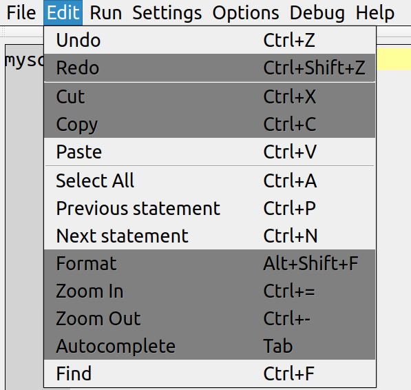

Ocelot ocelotgui

Version 0.6.0

This is Ocelot GUI (ocelotgui), a GPL-license database client.

Copyright (c) 2014, Ocelot Computer Services Inc.
All rights reserved.

For the GPL license terms see https://github.com/ocelot-inc/ocelotgui/blob/master/LICENSE.GPL.

For instructions for end users see the [User Manual](#user-manual).

For ocelotgui screenshots see http://ocelot.ca/screenshots.htm.

For ocelotgui/debugger screenshots see http://ocelot.ca/blog/the-ocelotgui-debugger.

This README file has instructions for getting started.
Ocelot does not supply the Qt libraries or the libmysqlclient
library. Therefore you will have to download them separately.

### Contents
------------

####Installing
... [Feeling lucky?](#feeling-lucky)
... [Getting the Qt libraries](#getting-the-qt-libraries)
... [Getting the libmysqlclient.so library](#getting-the-libmysqlclientso-library)
... [Getting the Qt libraries](#getting-the-ocelotgui-source-and-executable-files)
... [Getting the ocelotgui source and executable files](#an-installation-with-ubuntu-1204-64-bit)
... [An installation with Ubuntu 14.04, 64-bit](#an-installation-with-ubuntu-1404-64-bit)
... [An installation with Mageia 4.1, 64-bit](#an-installation-with-mageia-41-64-bit)
... [An installation with Fedora 20, 64-bit](#an-installation-with-fedora-20-64-bit)
... [An installation with SUSE 13.1, 32-bit, from source](#an-installation-with-suse-131-32-bit-from-source)
... [An installation with SUSE 42.1, from source in release tar](#an-installation-with-suse-421-from-source-in-release-tar)
... [An installation with SUSE 42.1, from source in git clone](#an-installation-with-suse-421-from-source-in-git-clone)
... [Installing by rebuilding source, on Ubuntu 12.04, without Qt Creator](#installing-by-rebuilding-source-on-ubuntu-1204-without-qt-creator)
... [Installing by rebuilding source, on Ubuntu 15.04](#installing-by-rebuilding-source-on-ubuntu-1504)
... [Installing by rebuilding source, with Qt Creator](#installing-by-rebuilding-source-with-qt-creator)  
####Illustrating
... [Some screenshots](#some-screenshots)
####Using
... [User Manual](#user-manual)
... [Executive Summary](#executive-summary)
... [The company, the product, and the status](#the-company-the-product-and-the-status)
... [Downloading, installing, and building](#downloading-installing-and-building)
... [Starting](#starting)
... [Statement widget](#statement-widget)
... [Client statements](#client-statements)
... [History widget](#history-widget)
... [Result widget](#result-widget)
... [Menu](#menu)
... [Debugger](#debugger)
... [Recent enhancements](#recent-enhancements)
... [Contact](#contact)

### Feeling Lucky?
------------------

Often a machine already has Qt and libmysqlclient.
In that case, be up and running in 15 seconds with:

    mkdir ~/ocelotgui-test
    cd ~/ocelotgui-test
    wget http://github.com/ocelot-inc/ocelotgui/releases/download/0.6.0/ocelotgui.tar.gz
    tar -zxvf ocelotgui.tar.gz
    cd ocelotgui
    ./ocelotgui-qt4 #or ./ocelotgui-qt5

If the above instructions succeed, there is no need to read
the rest of this document. But usually there is more to do.

### Getting the Qt libraries
----------------------------

The Ocelot-supplied 64-bit executable "ocelotgui-qt4" will
try to load libQtGui.so.4, the Qt 4 library. The Ocelot-supplied
64-bit executable "ocelotgui-qt5" will try to load libQtGui.so.5, the
Qt 5 library. You may find that the Qt packages are already installed,
since other common packages depend on them. If not, your Linux
distro's repositories will provide either Qt 4 or Qt 5,
most likely Qt 4.

The installation examples that follow do not assume that the
Qt libraries are already installed.

### Getting the libmysqlclient.so library
-----------------------------------------

The assumption is that you have already installed MySQL or MariaDB somewhere.
Therefore you may have a copy of libmysqlclient.so somewhere.
If it is not already on the default path, then an error or warning
will appear when you try to run ocelotgui. Find it, and say something like

export LD_RUN_PATH=[path to directory that contains libmysqlclient.so]

Several other directories are searched; for details start ocelotgui and 
choose Help | libmysqlclient.

The installation examples that follow do not assume that libmysqlclient.so
is already installed.

### Getting the ocelotgui source and executable files
-----------------------------------------------------

The official location of the project is on github: https://github.com/ocelot-inc/ocelotgui.
This is where the latest source files are. This is what can be "cloned".
Typically, to get it, one would install git, cd to a download directory, then

    git clone https://github.com/ocelot-inc/ocelotgui

A clone has the latest source, but not executables.

The releases for ocelot-inc/ocelotgui are also on github:
https://github.com/ocelot-inc/ocelotgui/releases
or https://github.com/pgulutzan/ocelotgui/releases.
A release includes the source files as of the release time,
and also two binary (executable) files.
Although the release does not have the "latest" source which is
in ocelot-inc/ocelotgui, the existence of the executables
might be convenient. A release file is highlighted in green
by github and is named ocelotgui.tar.gz. Thus release 0.6.0 is at
https://github.com/ocelotgui/releases/download/0.6.0/ocelotgui.tar.gz
or https://github.com/pgulutzan/ocelotgui/releases/download/0.6.0/ocelotgui.tar.gz.
Typically, to get it, one would cd to a download directory, then

    wget https://github.com/ocelot-inc/ocelotgui/releases/download/0.6.0/ocelotgui.tar.gz

or use a browser to go to https://github.com/ocelot-inc/ocelotgui/releases
and click ocelotgui.tar.gz.

Most of the installation examples that follow assume that download is
of a release.

### An installation with Ubuntu 12.04, 64-bit
---------------------------------------------

These steps worked after a fresh installation of Ubuntu 12.04,
a GNOME-based Linux distro, after downloading ocelotgui.tar.gz to ~/Downloads.

    cd ~/Downloads
    #Unpack ocelotgui.tar.gz to a new subdirectory named ocelotgui
    tar -zxvf ocelotgui.tar.gz
    cd ocelotgui
    #Install a package containing libmysqlclient.so and/or libmysqlclient.so.18
    #Maybe mysql-common would have sufficed.
    sudo apt-get install mysql-client
    #Install a package containing libQtGui.so.4
    sudo apt-get install libqt4-core
    #Then, as an ordinary non-root user, say something like
    ./ocelotgui-qt4 --host=127.0.0.1

### An installation with Ubuntu 14.04, 64-bit
---------------------------------------------

These steps worked after a fresh installation of Ubuntu 14.04,
a GNOME-based Linux distro, after downloading ocelotgui.tar.gz to ~/Downloads.

    cd ~/Downloads
    #Unpack ocelotgui.tar.gz to a new subdirectory named ocelotgui
    tar -zxvf ocelotgui.tar.gz
    cd ocelotgui
    #Install a package containing libmysqlclient.so
    #Maybe mysql-common would have sufficed.
    sudo apt-get install mysql-client
    #Install a package containing libQtGui.so.5
    #This is unnecessary, apt-get install will say "already latest version"
    sudo apt-get install libqt5core5a
    #Then, as an ordinary non-root user, say something like
    ./ocelotgui-qt5 --host=127.0.0.1 --user=root
Warning: Some menu shortcut keys may not work properly with this distro.

### An installation with Mageia 4.1, 64-bit
-------------------------------------------

These steps worked after a fresh installation of Mageia 4.1,
a KDE-based Linux distro, after downloading ocelotgui.tar.gz to !Downloads.

    cd ~/Downloads
    #Unpack ocelotgui.tar.gz to a new subdirectory named ocelotgui
    tar -zxvf ocelotgui.tar.gz
    cd ocelotgui
    #Install a package containing libmysqlclient.so
    #You can use "urpmf <library name>" to find
    #what packages contain libmysqlclient.so.
    #If the answer is lib64mariadb18, you can say as root:
    sudo urpmi lib64mariadb18
    #You will probably find that libQtGui.so.4 is already
    #present, so there is no need to install Qt libraries.
    #Use "whereis libQtGui.so.4" to make sure.
    #Then, as an ordinary non-root user, say something like
    ./ocelotgui-qt4 --host=127.0.0.1

### An installation with Fedora 20, 64-bit
------------------------------------------

These steps worked after a fresh installation of Fedora 20, a
GNOME-based Linux distro, after downloading ocelotgui.tar.gz to ~/Downloads.

    cd ~/Downloads
    #Unpack ocelotgui.tar.gz to a new subdirectory named ocelotgui
    tar -zxvf ocelotgui.tar.gz
    cd ocelotgui
    #Install a package containing libmysqlclient.so
    #This actually brings in the package supplied by MariaDB
    sudo yum install mysql
    #Find out where library libQtGui.so.4 is
    yum provides 'libQtGui.so.4'
    #Suppose "yum provides" says that you need qt-x11-4.8.6-10.fc20.i686
    #That's nice, but i686 is a 32-bit version, so change i686 to x86_64
    sudo yum install qt-x11-4.8.6-10.fc20.x86_64
    #Then, as an ordinary non-root user, say something like
    ./ocelotgui-qt4 --host=127.0.0.1

### An installation with SUSE 13.1, 32-bit, from source
-------------------------------------------------------

These steps worked after a non-fresh installation of openSUSE 13.1,
a KDE-based Linux distro, after downloading ocelotgui.tar.gz to ~/Downloads.

    cd ~/Downloads
    #Unpack ocelotgui.tar.gz to a new subdirectory named ocelotgui
    tar -zxvf ocelotgui.tar.gz
    #Use "cnf qmake" to confirm that these package names are correct.
    sudo zypper install libqt4-devel
    sudo zypper install mariadb-client
    sudo zypper install libmysqlclient-devel
    cd [path to ocelotgui source files]
    #Edit ocelotgui.pro.
    #Make sure that any of the lines that begins with "QMAKE_RPATHDIR + ..."
    #points to where libmysqlclient.so really is now. Example:
    #"QMAKE_RPATHDIR += /usr/local/mysql/lib/mysql"
    #Make sure that any of the lines that begins with "INCLUDEPATH+ ..."
    #points to where mysql.h really is now. Example:
    #"INCLUDEPATH += /usr/local/mysql/include/mysql"
    make clean             #usually unnecessary; ignore any error message
    rm Makefile            #usually unnecessary; ignore any error message
    qmake -config release
    #In the following line, if /usr/local/mysql/lib/mysql is not the path
    #where libmysqlclient.so is, replace with the correct name.
    #(This is usually not necessary.)
    export LD_LIBRARY_PATH=/usr/local/mysql/lib/mysql
    make
    #Then, as an ordinary non-root user, say something like
    ./ocelotgui

### An installation with SUSE 42.1, from source in release tar
--------------------------------------------------------------
    #This builds using the source files in the 0.6.0 "release"
    #To produce an executable named ~/ocelotgui-test/ocelotgui/ocelotgui
    sudo zypper install libqt4-devel
    sudo zypper install libmysqlclient-devel
    sudo zypper install git
    sudo zypper install gcc
    sudo zypper install gcc-c++
    sudo zypper install make
    mkdir ~/ocelotgui-test
    cd ~/ocelotgui-test
    wget http://github.com/ocelot-inc/ocelotgui/releases/download/0.6.0/ocelotgui.tar.gz
    tar -zxvf ocelotgui.tar.gz
    cd ocelotgui
    qmake -config release
    make
    #To uninstall, say: rm -r ~/ocelotgui-test

### An installation with SUSE 42.1, from source in git clone
------------------------------------------------------------
    #This builds using the source files in the very latest "post-release"
    #To produce an executable named ~/ocelotgui-test/ocelotgui/ocelotgui
    sudo zypper install libqt4-devel
    sudo zypper install libmysqlclient-devel
    sudo zypper install git
    sudo zypper install gcc
    sudo zypper install gcc-c++
    sudo zypper install make
    mkdir ~/ocelotgui-test
    cd ~/ocelotgui-test
    git clone https://github.com/ocelot-inc/ocelotgui
    cd ocelotgui
    qmake -config release
    make
    #To uninstall, say: rm -r ~/ocelotgui-test

### Installing by rebuilding source, on Ubuntu 12.04, without Qt Creator
------------------------------------------------------------------------

All Ocelot source files are supplied in subdirectory ocelotgui.

Examples here use the common Ubuntu install method, "apt-get".
Other Linux distros will have different methods, such as "yum" or "yast2",
and will have different names for the Qt packages.

If the intent is to rebuild for Qt 4 from source:

    sudo apt-get install qt4-qmake
    sudo apt-get install libqt4-dev
    cd [path to ocelotgui source files]
    make clean
    /usr/bin/qmake-qt4 -config release
    make

### Installing by rebuilding source, on Ubuntu 15.04
----------------------------------------------------

    #These steps have been known to work for an experiment.

    #Get Qt libraries. The message "already installed" might appear.
    sudo apt-get install qt5-default qtbase5-dev qt5-qmake qtbase5-dev-tools
    #Get MySQL libraries. Either libmysqlclient-dev or libmariadbclient-dev.
    sudo apt-get install libmariadbclient-dev

    #Get latest source from github repository, non-release
    cd ~
    git clone https://github.com/ocelot-inc/ocelotgui
    #Build
    cd ~/ocelotgui
    #Following might have to be /usr/lib/x86_64-linux-gnu/qt5/bin/qmake
    qmake
    make
    #Start the program to make sure it starts (stop again with File|Exit or ^Q).
    ./ocelotgui

### Installing by rebuilding source, with Qt Creator
----------------------------------------------------

For any version or common distro, one can download Qt Creator
from the Qt download site http://qt-project.org/downloads.
When confronted with the "License Agreement" dialog box,
remember that ocelotgui is licensed under GPL version 2,
so we recommend picking LGPL and re-conveying as GPL.

Make sure a C++ compiler such as g++ is installed first.

Edit [path]/ocelotgui.pro: change INCLUDEPATH to a path
that includes the file "mysql.h". It comes with MySQL or
MariaDB developer packages, for example "sudo apt-get
libmysqlclient-dev" will put it in directory /usr/include/mysql.

    #Edit [path]/ocelotgui.pro.
    #Make sure that any of the lines that begins with "QMAKE_RPATHDIR + ..."
    #points to where libmysqlclient.so really is now.
    #It comes with MySQL or MariaDB,
    #for example "sudo apt-get mysqlclient" will put it
    #in file/usr/lib/x86_64-linux-gnu/libmysqlclient.so.
    #Example:
    #"QMAKE_RPATHDIR += /usr/local/mysql/lib/mysql"
    #Make sure that any of the lines that begins with "INCLUDEPATH+ ..."
    #points to where mysql.h really is now. Example:
    #"INCLUDEPATH += /usr/local/mysql/include/mysql"
    #(mysql.h comes with MySQL or MariaDB developer packages.
    # For example "sudo apt-get libmysqlclient-dev" will
    # put it in directory /usr/nclude/mysql).

You will need to state a compiler for the kit.
Steps for Qt Creator use are:

    Click File | Open File or Project ...
    In "Open File" dialog box, in field "File name:", enter [path]/ocelotgui.pro
    Click Next
    Click Configure Project

If you get a message "cannot find -lGL" when you
try to run the project, try to install GL.
With Ubuntu: sudo apt-get install libgl1-mesa-dev.
With Fedora: sudo yum install mesa-libGL-devel.

Using Qt Creator is the method that Ocelot itself uses regularly,
and it is simple to install for most Linux distros. However,
it requires a large amount of disk space.

For more commentary about compiling and building,
read an ocelotgui.cpp comment that begins with the words
"General comments".

## Some screenshots
-------------------

 
 
 
 
 
 
 
 
 
 

## User Manual
-------------- 
  
Version 0.6.0, June 29 2015  
  
Copyright (c) 2014 by Ocelot Computer Services Inc. All rights reserved.  
  
This program is free software; you can redistribute it and/or modify  
it under the terms of the GNU General Public License as published by  
the Free Software Foundation; version 2 of the License.  
  
This program is distributed in the hope that it will be useful,  
but WITHOUT ANY WARRANTY; without even the implied warranty of  
MERCHANTABILITY or FITNESS FOR A PARTICULAR PURPOSE. See the  
GNU General Public License for more details.  
  
You should have received a copy of the GNU General Public License  
along with this program; if not, write to the Free Software  
Foundation, Inc., 51 Franklin St, Fifth Floor, Boston, MA 02110-1301 USA  

### Executive Summary
---------------------

The ocelotgui application, more fully
'The Ocelot Graphical User Interface', allows users to connect to
a MySQL or MariaDB DBMS server, enter SQL statements, and receive results.
Some of its features are: syntax highlighting, user-settable colors
and fonts for each part of the screen, and result-set displays
with multi-line rows and resizable columns, and a debugger.

### The company, the product, and the status
--------------------------------------------  

Ocelot Computer Services is a Canadian company
which has specialized in database products for thirty years.
Its two employees both worked for MySQL AB and
Sun Microsystems and Oracle between 2003 and 2011.  
  
The ocelotgui program is a front end which connects to MySQL (tm) or MariaDB (tm).
In some ways it is like the basic mysql client program,
with added GUI features: full-screen editing, syntax
highlighting, tabular display, customized fonts and colors.
It differs from some other front-end GUI products because
it is open source (GPL), is written in C++, and it makes use
of the Qt multi-platform widget library.  
  
The product status is: alpha. It has been known to work as described in
this manual on several Linux distros but it would be premature
to recommend use with critical production systems. We are making only
one guarantee, that we will try to address any bug reports
and answer questions from people examining the source code.  
 
### Downloading, installing, and building
----------------------------------------- 

To download the product go to
https://github.com/ocelot-inc/ocelotgui.
Instructions for installation will be in the README.md file.
This location may change, or alternate locations may appear.
If so there will either be an announcement on github or on ocelot.ca.  
  
The package contains source code, and
two executable files, one for use with Qt version 4 and the
other for use with Qt version 5.
The executables are built dynamically.
They look for pre-installed copies of Qt libraries and of the
MySQL client library -- see the README.md file about these.
The executables were built with Ubuntu 12.04 and may not work
well on other Linux distros -- if that is the case, consult
the README.md and the source code to see how to build from
source. 
 
### Starting
------------

There must be an instance of MySQL or MariaDB running somewhere.  
  
If connection is possible with the mysql client and does not require
unusual options, then connection is possible with ocelotgui. If there is
a my.cnf file, ocelotgui will read it, just as the mysql client would.
If there are connection-related options on the command line, ocelotgui
will accept them just as the mysql client would. Therefore the typical
way to start the program is to say
ocelotgui [--option [ --option...]]  
  
If a password is required but not supplied, or if the initial
attempt to connect fails, a dialog box will appear.  
Fill in or correct the fields on the dialog box and click OK.  
If the connection still fails, then ocelotgui will still come up,
but only non-DBMS tasks such as screen customizing will be possible.  
  
In any case, an initial screen will appear. After some activity has
taken place, the screen will have four parts, from top to bottom:  
menu  
history widget, where retired statements and diagnostics end up  
results widget, where SELECT result sets appear  
statement widget, where users can type in instructions.  
Initially, though, only the menu and statement widget will appear.  
  
Again, this should be reminiscent of the way the mysql client works:
statements are typed at the bottom of the screen, and appear to
scroll off the top after they are executed, with results in the middle.  
 
### Statement widget
--------------------

The statement widget is an editable multi-line text box.
The usual control keys that work on other text editors will work
here too; see the later description of Menu Item: Edit.  
  
The program includes a tokenizer and can recognize the parts of
speech in typical MySQL grammar. It will do syntax highlighting
by changing the color, for example comments will appear in red,
dentifiers in blue, operators in green, and so on.  
The colors can be
customized, see the later description of Menu Item: Settings.  
  
The left side of the statement widget is reserved for the prompt,
and cannot be typed over. Initially the prompt will be 'mysql&gt;',
but this can be changed, see the later description of
Client Statements: Prompt.  
  
Once a statement has been entered and is ready to be executed,
the user can hit control-E, choose menu item Run|Execute, or
place the cursor at the end of the text (after the ';' or other
delimiter) and type Enter. It is legal to enter multiple
statements, separated by semicolons, and then execute them
in a single sequence.  

### Client statements
---------------------

A client statement is a statement which changes some behavior
of the client (that is, of the ocelotgui front end) but does not
necessarily go to the MySQL/MariaDB server. Of the statements
that the MySQL Reference manual describes in section
'mysql commands' http://dev.mysql.com/doc/refman/5.6/en/mysql-commands.html  
  
the ocelotgui program has working equivalents for: clear, delimiter, exit,
prompt, source, tee, and warnings. For example, entering 'quit;'
followed by Enter will cause the program to stop. It is
sometimes not mandatory to end a client statement with ';',
but is strongly recommended.  
  
There are some enhancements affecting the PROMPT statement.
The special sequence '&#92;2' means 'repeat the prompt on all lines',
and the special sequence '&#92;L' means 'show line numbers'. For example,
'PROMPT &#92;2&#92;Lmariadb;' will change the prompt so that each line begins
with '[line number] mariadb>'.  

### History widget 
------------------

Once a statement has been executed, a copy of the statement text
and the diagnostic result (for example: 0.04 seconds, OK) will
be placed in the history widget. Everything in the history widget
is editable including the prompt, and it simply fills up so that
after a while the older statements are scrolled off the screen.  
Thus its main function is to show what recent statements and
results were. Statements in the history can be retrieved while
the focus is on the statement widget, by selecting 'Previous statement'
or 'Next statement' menu items.  

### Result widget
-----------------

If a statement is SELECT or SHOW or some other statement that
returns a result set, it will appear in the result widget in
the middle area of the screen. The result widget is split up
into columns. Each column has a header and details taken from
what the DBMS returns.  
  
The width of the column depends on the result set's definition,
but extremely wide columns will be split onto multiple lines.
That is, one result-set row may take up to five lines.  
If the data still is too wide or too tall to fit in the cell,
then the cell will get a vertical scroll bar. The user can
change the width of a column by dragging the column's right
border to the right to make the column wider, or to the left
to make it narrower.  
  
The result widget as a whole may have a horizontal and a vertical
scroll bar. The vertical scroll bar moves a row at a time rather
than a pixel at a time -- this makes large result sets more
manageable, but makes the vertical scroll bar unresponsive if
each row has multiple lines and the number of rows is small.  

### Menu
--------

The menu at the top of the screen has File, Edit, Run, Settings,
Options, Debug and Help.  

File|Connect, or Ctrl+O, starts the Connect dialog box.  
File|Exit, or Ctrl+Q, stops the program.  

Edit|Undo or Ctrl+Z, Edit|Redo or Ctrl+Shift+Z, Edit|Cut or Ctrl+X,
Edit|Cut or Ctrl+X, Edit|Copy or Ctrl+C, Edit|Paste or Ctrl+V,
and Edit|Select or Ctrl+A, all work in the conventional manner.
Edit|Redo can only redo the last change.  
Previous Statement or Ctrl+P and Next Statement or Ctrl+N will
copy earlier statements from the history widget into the statement
widget, so that they can be edited or re-executed with Run|Execute
or Ctrl+E.  

Run|Execute or Ctrl+E or Ctrl+Enter causes execution of whatever is in the
statement widget.  
Run|Kill or Ctrl+C tries to stop execution -- this
menu item is enabled only when a long-running statement
needs to be aborted by user intervention.  

Settings|Menu, Settings|History Widget, Settings|Grid Widget,
Settings|Statement, and Settings|Extra Rule 1 are
items which affect the behavior of each
individual widget. The color settings affect foregrounds,
backgrounds, borders, and (for the statement widget only)
the syntax highlights. The font settings affect font family,
boldness, italics, and size. Font settings
involve further dialog boxes which are standard with Qt.
There may be additional choices affecting appearance,
for example the width of the border used to drag columns
in the result widget.
Settings|Extra Rule 1 is conditional -- for example, to specify
that BLOBs should be displayed as images on a pink background,
set Grid Background Color Pink, set Condition = data_type LIKE
'%BLOB', set Display As = image, then click OK.  

Options|detach history widget,
Options|detach result grid widget,
Options|detach debug widget are
for turning the respective widgets into independent windows,
so that they can be moved away from the statement widget,
or resized. A detached widget is always kept on top of the
other widgets in the application screen. When a widget is
already detached, the menu item text will change to "attached"
and clicking it will put the widget back in its original position.  

The items on the Debug menu are enabled only when a debug session
is in progress. The way to debug SQL stored procedures or functions
will be explained in a later section.  

Help|About will show the license and copyright and version.
Help|The Manual will show the manual, a shortened version of what you are reading now.
Help|libmysqlclient will advise about finding and loading the libmysqlclient.so library.
Help|settings will advise about how to use the Settings menu items.

Help|

  

### Debugger
------------

It's possible to debug stored procedures and functions.  
This version of ocelotgui incorporates MDBug
(read about MDBug at http://bazaar.launchpad.net/~hp-mdbug-team/mdbug/trunk/view/head:/debugger.txt).  
All debugger instructions can be entered on the ocelotgui command line;  
some operations can also be done via the Debug menu or by clicking on the stored-procedure display.  
Currently-supported instructions are:  
$install -- this is always the first thing to do  
$setup routine_name [, routine_name ...] -- prepares so '$debug routine_name' is possible  
$debug routine_name -- starts a debug session, shows routines in a tabbed widget  
$breakpoint routine_name line_number or Debug|breakpoint -- sets a breakpoint  
$clear routine_name line_number -- clears a breakpoint  
$next or Debug|Next -- goes to next executable line, without dropping into subroutines  
$step or Debug|Step -- goes to next executable line, will drop into subroutines  
$continue or Debug|Continue -- executes until breakpoint or until end of procedure  
$refresh breakpoints -- refreshes xxxmdbug.breakpoints table  
$refresh server_variables -- refreshes xxxmdbug.server_variables table  
$refresh variables -- refreshes xxxmdbug.variables table  
$refresh user_variables -- refereshes xxxmdbug.user_variables table  
$exit or Debug|Exit -- stops a debug session  
  
For a walk through a debugger example, with screenshots, see
this blog post: ocelot.ca/blog/the-ocelotgui-debugger.  

### Recent Enhancements 
-----------------------

Here are new features which work (or work more correctly) when ocelotgui is built
from source, and will appear in binary executables
when the next release occurs.  
Vertical: If a user starts the program with ocelotgui --vertical=1
or ends a statement with backslash G, results come up with one column per row.  
Images: If a user chooses Settings | Extra Rule 1 from the menu,
and sets the Condition and Display As boxes as described earlier,
and selects rows which contain LONGBLOB columns, and the column values are
images (such as PNG or JPEG or BMP or GIF format data), ocelotgui will display
the result as images.  
Result-set editing: If a user clicks on a column in the result set
and makes a change, an update statement will appear in the statement widget.
For example, if a result set is the result from SELECT column1, column2 FROM t;,
and the column1 value is 5, and the column2 value is 'ABC', and the user changes
the column2 value to 'AB', then the
statement widget will show UPDATE t SET column2 = 'AB' WHERE column1 = 5 AND column2 = 'AB';.
The user then has the choice of ignoring the update statement or executing it.
Detaching: If a user chooses Options | detach history widget or
Options | detach result grid widget, then the widget will become a separate window
which can be moved or resized.  
Colors: The Colors and fonts dialog boxes now have a simpler way to choose
colors, by selecting from a choice of 148 color names / color icons. Users can also
change colors by saying SET object_name_color = color-name | hex-rgb-value.  
Run|Kill: When an SQL statement is taking a long time, the menu changes so
that Run|Execute (Ctrl+E) is disabled and Run|Kill (Ctrl+C) is enabled.
Selecting Run|Kill stops the statement if possible.  

### Contact
-----------  

Bug reports and feature requests may go on  
https://github.com/ocelot-inc/ocelotgui/issues.  
  
There may be announcements from time to time on Ocelot's
web page (ocelot.ca) or on the employee blog (http://ocelot.ca/blog).  
This manual may also be available on ocelot.ca soon.  
  
Any contributions will be appreciated.  

